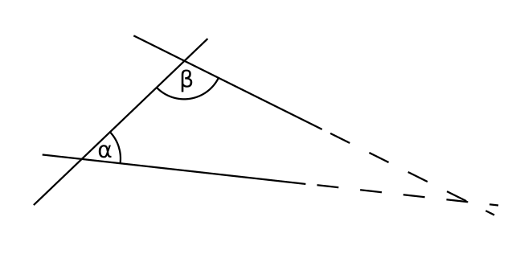

## 목차

1. 머리말
2. 철학의 4대 혁명과 근대 철학의 역사적인 흐름  
   2.1. 철학의 4대 혁명: 코페르니쿠스, 찰스 다윈, 프로이트, 엘런 튜링  
   2.2. 근대 철학의 주요 인물들: 칸트, 헤겔, 쇼펜하우어, 니체  
3. 쇼펜하우어의 철학과 영향  
   3.1. 칸트 철학과 불교 철학 기반  
   3.2. 힘과 의지의 개념과 이것이 철학에 미친 영향  
   3.3. 논리학 비판  
4. 한국에서의 부족한 철학교육과 쇼펜하우어의 입지  
   4.1. 과도한 입시 문화에 따른 부족한 철학교육  
   4.2. 미흡한 쇼펜하우어에 대한 연구  
5. 미래와 쇼펜하우어  
   5.1. 지식을 전하는 대학 교육보다는 꿈을 좇는 교육  
   5.2. 더욱 중요해지는 상상력과 창의력  

---

이 글은 제가 하느님을 믿기 이전 학부시절에 쓴 철학 저널 입니다.

원글은 [PDF](쇼펜하우어가_인류에_미친_영향과_미래의_교육에_관한_고찰_한수민.pdf)에서 읽어보세요..^^

---

### 1. 머리말

4차 산업 혁명과 더불어 사람들에게는 기계적인 업무가 아닌 인간만이 할 수 있는 창의적이고 예술적인 능력이 점차 중요해 지고 있다. 그러나 여전히 한국의 대학은 기술을 가르쳐 취업률을 높이는 데 급급하고, 학부모들은 아이들을 선행시켜 더 다양한 지식을 가르치도록 재촉하는 현실이다. 물론 당장 정착된 교육 시스템과 분위기를 바꾸기는 힘들 것이다. 그러나 철학은 10년 단위의 교육이 아니라 100년 단위로 변화할 수 있는 통찰력을 제공할 수 있다. 이 글에서는 근대 철학에 지대한 영향을 미친 쇼펜하우어의 철학에 대해 알아보고, 쇼펜하우어의 철학이 어떻게 과학, 문학 등에 영향을 끼쳤는지를 연구해 보았다. 이를 통해 쇼펜하우어의 철학이 어떤 역사적인 흐름을 만들었는지를 이해함으로써, 한국의 미래 교육을 설계하는데 밑거름이 되어 보고자 한다. 다만 이 글은 전문가적인 수준으로 철학을 이해하기 위한 취지로는 적혀지지 않았기 때문에 최대한 일반적인 이해의 범위 내에서 쉽게 글을 쓰려고 노력하였다. 그로 인해 쇼펜하우어가 진실로 의미하는 바가 변질되었을 우려가 있기에, 그 부분에 있어서 미리 쇼펜하우어에게 죄송한 마음으로 글에 임한다. 또한, 독자는 직접 원본이나 번역본을 찾아 읽는 것이 더 정확한 이해에 도움이 될 것이다.

### 2. 철학의 4대 혁명과 근대 철학의 역사적인 흐름 
   
쇼펜하우어에 대해 알아보기 이전에 철학이 어떻게 인간의 사고에 영향을 끼치게 되는지, 그리고 쇼펜하우어는 어떠한 철학적인 흐름 속에서 태어났는지를 알아보자. 

먼저 철학의 4대 혁명이라는 개념과 근대 철학의 인물들의 흐름을 알아보아야 할 것이다. 철학의 4대 혁명이라는 개념은 현재 옥스퍼드 대학에서 정보 및 윤리 철학 교수로 활동하는 루치아노 플로리디에 의해 소개되었다 [Author Luciano Floridi (2014-06-23)](https://youtu.be/JGUCOCsSTAE). 그의 주장에 따르면 철학의 4대 혁명은 코페르니쿠스(지동설), 찰스 다윈(진화론), 지그문트 프로이트(정신분석학), 엘런 튜링(컴퓨터의 발명)으로 이루어져 있으며, 각각의 인물들은 당대의 사람들의 일반적인 통념에 큰 충격을 주었다. 

**첫째로** 코페르니쿠스는 별들이 지구 주위를 돈다는 천동설을 깨고, 지구가 태양 주위를 돈다는 주장을 하였다. 당시로써는 인간이 세상의 중심이기 때문에 그것을 기반으로 한 천동설에 반기를 든다는 것은 인간이 예수를 통해 신과 대화를 할 수 있다는 기독교 사상을 부정하는 행위였다. 그로 인해 코페르니쿠스는 화형에 이르게 된다. 그러나 이후 갈릴레오 갈릴레이를 포함한 많은 과학자에 의해 지동설이 입증되었고 인간이 세상의 중심이 아님을 깨닫게 한 최초의 사건이 되었다. 

**둘째로** 찰스 다윈은 진화론을 주장하였고, 원숭이가 진화하여 인간이 되었다는 당시로는 황당무계한 발언을 하였다. 진화론의 바탕에도 여전히 사람들에게는 인간은 특별하므로 인간은 신이 자신의 형상을 본 따 만들었다는 기독교적인 사상에 젖어있었다. 그리고 결과적으로 진화론이 시사하는 바는 인간은 특별하게 창조되어 만들어지지 않았다는 것이다. 이는 인간의 자존심에 크게 금이 가게 하는 이론이었고, 이것을 애써 부정하기 위해 기독교계에서는 아직까지 창조론이 옳다는 증명을 시도하지만 명확한 대답을 하지 못하고 있다. 

**셋째로** 지그문트 프로이트가 연구한 정신분석학인데, 이것은 인간의 행동은 논리적인 것이 아니라 리비도(Libido: 성 에너지)와 타나토스(Thanatos: 공격성, 공격적 에너지)에 의해 움직인다는 것이다 (정도언, 『프로이트의 의자』, 웅진 지식하우스, 2009, pp. 46-48). 이는 인간의 이성에 대한 의구심을 품게 했고, 동물과 유일하게 구분되어 인간이 가지는 고유한 가치라고 믿었던 이성적이고 논리적인 사고능력을 부정하게 되었다. 다시 말해 인간은 이성적이고 합리적인 존재가 아니라, 결국 성욕과 공격성에 의해 행동하는 동물적인 존재이며, 인간이 내리는 사고는 이성을 가장한 본성의 발현이라는 것이다. 

**마지막으로** 엘런 튜링이 발명한 컴퓨터에 의한 정보 혁명이다. 엘런 튜링은 세계 2차 대전에 독일군의 암호 기계를 해독하기 위해 최초의 해독 기계를 개발하였다. 이것은 컴퓨터의 기반이 되었고, 엘런 튜링은 이 기계가 인간을 모방할 수 있는 언어 능력을 갖출 수 있다고 믿었다. 현재 인공지능의 대화 능력을 측정하기 위해 인공지능과 인간의 대화를 보고 누가 기계이고 사람인지를 맞추는 시험을 튜링 테스트라고 부르는 것도 여기서 유래되었다. 그리고 근래에 인공지능의 성능이 상상 이상으로 발전하며 인간만의 영역이라고 생각되었던 바둑에서도 알파고가 승리를 거두자 인간의 사고 능력을 기계가 대체할 수 있지 않을까에 대한 의문이 생기고 있다. 이렇듯 역사적으로 진리라고 믿어졌던 이론들도 용기 있는 과학자와 철학자에 의해 반론이 제시되었고 수많은 핍박과 저항을 거쳐 끝내 새로운 정설이 받아들여지게 된다. 이것은 더더욱 인간은 합리적이고 이성적으로 움직이는 동물이 아니라 자신의 신념과 기득권에 의해 움직이며, 나아가서는 진화론적인 외형과 심리학적인 내면의 사고뿐만 아니라 그 원천조차도 특별하지 않을 수 있다는 가능성을 암시한다. 

위의 철학계의 혁명의 흐름과 비슷하게, 쇼펜하우어가 주장하는 의지라는 개념도 모든 생명을 움직이는 근본적인 원동력을 추상적으로 의미한다. 쇼펜하우어는 위의 인물 중 특히 찰스 다윈과 지그문트 프로이트에게 철학적인 영향을 끼쳤다.

### 3. 쇼펜하우어의 철학과 영향  

이제 쇼펜하우어가 태어난 시대적 흐름에 대해 알아보자. 우선 쇼펜하우어(Arthur Schopenhauer, 1788--1860)는 칸트(Immanuel Kant, 1724--1804) 이후에 태어났으며 칸트 철학에 지대한 영향을 받았다. 칸트는 근대 철학을 상세하고 명확히 그 근본을 정립해 나가는데 엄청난 공헌을 하였다. 형이상학, 물자체, 선험적 관념론 등의 수많은 개념을 정립하였고, 『순수이성비판』, 『실천이성비판』, 『논리학』 등의 수많은 저서를 남겼다. 칸트에 대한 연구는 한국에서도 이정직(李定稷, 1841--1910)의 공헌으로 한국에 서양 철학이 유입될 시기부터 그 연구가 활발하였다. 이후 헤겔(Georg Wilhelm Friedrich Hegel, 1770--1831)이 칸트의 철학을 이어 논리학과 변증법에 대한 개념을 정립하였으나, 쇼펜하우어는 헤겔의 철학을 혐오하였고 쇼펜하우어는 당시의 철학자들은 밥벌이를 위해 대중들을 속이는 사기꾼이라며 많은 갈등을 가졌다. 그는 겨우 30세의 나이에 일생의 역작 『의지와 표상으로서의 세계』를 완성하였으나 당시에는 책이 많이 팔리지 않았고, 이후 대학교수를 하였으나 헤겔과 같은 시간에 일부러 시간표를 짜고 수강생이 부족하자 단 1학기만 수업하고 대학을 박차고 나가 혼자서 연구를 시작하였다. 다행히도 쇼펜하우어는 60세 가까이가 되어서야 업적을 인정받아 유명해지기 시작했고 자신의 저서 『의지와 표상으로서의 세계』에도 이렇게 기록하였다.

> 나도 마침내 그 나이에 도달하여 이제 내 생애의 막바지에 효력이 나타나기 시작하는 것을 보고 만족감을 느끼며, 옛날의 통례에 비추어 볼 때 뒤늦게 시작된 만큼 오랫동안 지속되리란 희망을 품는다.. A. Schopenhauer, 홍성광, 『의지와 표상으로서의 세계』 개정증보판, 을유문화사, 2015, p. 36 -- 〈3판 머리말 中〉

쇼펜하우어는 기존의 논리학적인 철학과 달리 새로운 개념인 “생의 의지(Wille zum Leben)”로 현상을 설명한다. 『의지와 표상으로서의 세계』에 담긴 철학을 간략하게 말하자면 “모든 현상은 삶에 대한 맹목적인 의지가 드러난 표상” 나무위키, “아르투어 쇼펜하우어”에서 인용 (2017-06-21)
이라는 것이다. 쇼펜하우어의 철학에서 세계는 Wille(의지라고 번역은 되지만 성욕과 공격성, 생명력 등을 모두 내포하는 개념이다) 이라고 하는 것에 의해 욕망이 생기고 발현된다. 또한, 우리가 얻을 수 있는 선험적인 진리(경험하기 이전에 얻을 수 있는 진리라는 의미)는 인간은 세계를 아는 것이 아니라 세상을 느낄 수 있는 감각기관만을 갖고 있다는 것, 세계는 오직 객관적인 상태인 ‘표상’으로서 존재한다는 것이라는 것이다. 반면 헤겔은 진리를 추구하기 위해서는 정반합의 과정이 수반된다고 주장하였으며, 사전에도 “<철학> 헤겔에 의하여 정식화된 변증법 논리의 삼 단계. 곧 하나의 주장인 정(正)에 모순되는 다른 주장인 반(反)이, 더 높은 종합적인 주장인 합(合)에 통합되는 과정을 이른다.”라고 등재되어 있다 (국립국어원 표준국어대사전, “정반합”).

종합적으로 보자면 헤겔의 방법은 논리적이고 귀납법적인 접근으로 진리를 얻는 것이고, 쇼펜하우어의 방법은 본능적이고 비논리적으로 직감에 따라 진리를 얻는 것이다. 그러나 많은 사람은 쉽게 쇼펜하우어의 생각에 동의하지 못할 것이다. 대부분의 사람은 지식을 수동적으로 누군가에게 전해 들어왔고 끊임없이 가르쳐 들어서 배워왔기 때문이다. 그러나 창의적이고 예상치 못하게 기발한 생각을 해내는 사람들은 쇼펜하우어의 철학과 많이 닮아있다. 역사적인 의미를 가지는 과학적인 발명과 문학적인 작품들은 점진적이고 논리적인 과정이 아니라 순간적이고 역동적인 영감에 의해 얻어지는 경우가 수없이 많기 때문이다. 예를 들어 미래학자 레이커즈와일이 미래는 아무도 예측할 수 없으므로 인류의 기술 발전 속도는 점진적인 것이 아니라 매 순간 급격히 예상하지 못할 만큼 발전하여 2045년에는 인공지능이 인간을 초월하는 특이점이 올 것이라고 주장하는 것에 빗대어 볼 수 있다 (Ray Kurzweil, Singularity is near, Viking, 2005). 쇼펜하우어의 “생의 의지”의 개념은 이후에 니체(Friedrich Wilhelm Nietzsche, 1844--1900)가 “힘에의 의지(Wille zur Macht)”라는 개념을 정립할 때 엄청난 영향을 끼쳤다. 니체는 『의지와 표상으로서의 세계』를 읽고 아래와 같은 글을 남겼다.

> "매 문장마다 거부, 부정, 체념 등을 외치고 있었다. 나는 이 책에서 세계, 삶, 고유한 정서를 볼 수 있는 거울을 만났다. 정말 대단한 만남이었다. 나는 아무런 경향성도 없는 예술의 꽃을 보았고, 질병과 치료, 추방과 도피처, 지옥과 천국을 보았다. 자기 인식에 대한 욕구가 밀려들었다." - 프레드리히 니체

이후 쇼펜하우어는 니체뿐 아니라 비트겐슈타인, 하이데거에 이어지는 철학의 계보에도 큰 영향을 끼쳤다. 또한, 카를 융과 프로이트의 정신분석학, 아인슈타인의 상대성 이론, 슈뢰딩거의 양자 역학, 토마스 만과 톨스토이의 문학에 이르기까지 지대한 영향을 끼쳤다.

앞에서 설명한 것처럼 쇼펜하우어의 철학은 근본적으로 칸트의 철학을 바탕으로 하고 있다. 『의지와 표상으로서의 세계』에서도 다음과 같이 밝혔을 정도이다.

> 사실 칸트의 주저를 읽은 사람이 그로 인해 정신에 받는 영향은 장님이 내장안 수술을 받은 것에 비유할 수 있을 것이다. (... 중략 ...) 칸트 철학이야말로 여기서 사상을 펼쳐 보일 때 철저히 알아야 하는 전제가 되는 유일한 철학이다. A. Schopenhauer, 앞의 책, pp.14-18 -〈1판 머리말 中〉

> 칸트 철학을 자기것으로 만들지 못한 사람은 그 외에 무엇을 연구한다 해도, 흡사 순진무구한 상태, 말하자면 우리 모두가 태어날 때와 같은 자연 그대로의 어린애 같은 실재론의 상태에 머물게 된다. A. Schopenhauer, 앞의 책, p. 29 -〈2판 머리말 中〉

쇼펜하우어는 불교의 허무주의적인 사상에 심취해 있었는데 이것이 서양 철학에 불교적인 관점이 녹아 서양식 니힐리즘(Nihilism, 허무주의)을 만드는 데 큰 영향을 끼쳤다. 이후 니체가 이를 이어받아 완성형으로 만들었다고 볼 수 있다. 니체가 말했던 “신은 죽었다”라는 명언은 단순한 농담이 아니라 형이상학 -- "형이상학metaphysica 은 문자 그대로 '형상위의 것', '감각적인 것 너머의 것', 바꿔 말하면 자연 저편의 것에 관한 학이다. 형이상학은 명칭상 자연, 곧 경험 대상의 총체를 넘어서는 것, 그러니까 "초감성적인 것에 관한 학"이다." (Immanuel Kant, 백종현, 『순수이성비판1』, 아카넷, 2006, p. 26) -- 즉 인간 세계를 벗어난 저 편의 신들의 세상(절대 진리)에 대한 철학을 부정하고 인간이 스스로 자기 극복을 추구하는 위버멘쉬(Übermensch) 사상을 의미한다. 쇼펜하우어는 불교에서 고통 속의 수행을 통해 해탈을 지향하는 것처럼 충동적이고 끝없는 욕망을 갈구하는 생의 의지를 조절함으로써 더욱 자신을 발전시킬 수 있다고 하였고, 이것이 니체의 니힐리즘에 큰 영향을 끼쳤다고 볼 수 있다.

쇼펜하우어는 힘과 의지의 개념으로 현상을 설명하였다. 특히 의지(Wille)란 “일반적인 의미의 뜻뿐만이 아니라, 인간의 다른 맹목적인 감성인, "욕망", "갈구함", "추구", "노력", "고집" 까지 포괄하는 개념이다.” (위키피디아(ko), “의지와 표상으로서의 세계” (2017-06-21))
 또한 쇼펜하우어는 다양한 자연현상을 의지의 개념으로 설명하였다. 먼저 인간의 신체에 대해서는 “신체와 의지의 관계”, “의지이자 표상으로서의 신체”, “욕구의 발현으로서의 신체” 등의 장에서 의지의 발현으로 신체가 발달하였음을 설명하고 있으며 (A. Schopenhauer, 앞의 책, pp. 185-199)
 이것이 이후 찰스 다윈의 진화론에 영향을 끼쳤을 것이다. 그리고 “창조적 천재의 광기”, “예술가와 예술 작품”, “미적 만족을 느끼는 주관적 조건” 등의 장에서 예술을 의지의 집합체라고 보고 있으며 그 가치를 높이 샀다 (A. Schopenhauer, 앞의 책, pp. 308-333)
. 특히 음악에 대해서는 전 세계를 통틀어 이해할 수 있는 언어이며 시간의 제약이 없는 시공간을 초월한 의지를 담고 있다고 보았다 (Wikipedia(En), “Arthur Schopenhauer” - Art and aesthetics (2017-06-21)).

또한 쇼펜하우어는 논리학에 대해서 크게 비판했다. 그는 “논리학은 결코 실제로 유익하지 않고 철학에는 이론적인 관심만 있을 뿐이어서 이들 규칙을 기억해 둘 필요는 없다.” (A. Schopenhauer, 앞의 책, p. 105)
거나 “논리학을 실제로 사용할 수 있는 유일한 경우는 논쟁을 하면서 실제로 상대방의 틀린 결론을 증명할 때라기보다는 그의 고의적인 그릇된 추론을 전문 용어로 지적하며 증명할 때이다.” (A. Schopenhauer, 앞의 책, p. 108)
 라고 평가했다. 자신이 쓴 『토론의 법칙』에서도 얼마나 인간이 합리적인 모습을 가장하여 승리를 얻기 위해 궤변과 잔꾀, 속임수 등을 사용하는지를 낱낱이 보여주고 있다.

> 이제 나는 객관적으로 옳고 그르고의 여부를 고려하지 않는 논쟁기술들을 보여줄 것이다. 왜냐하면 객관적 사실이라는 문제에 대해서는 그 누구도 확실하게 알 수 없기 때문이다. 이것은 논쟁이 끝나봐야 비로소 판가름 나게 될 것이다. (A. Schopenhauer, 최성욱, 『토론의 법칙』, 원앤원북스, 2016, p. 20)  - 『토론의 법칙』 中

그는 그 누구보다 논리적인 사고에 대해 비판했고, 그러한 변증법적인 사고로는 진리를 얻을 수 없다고 보았다. 특이하게도 이러한 사고는 수학에도 영향을 끼쳤는데, 쇼펜하우어는 유클리드 기하학에서 평행선 공준에 대해 비판한 바가 있다. 평행선 공준이란 아래의 그림에서 “만약 α + β < 180°라면, 두 직선은 한 점에서 언젠가는 만난다.”라는 얼핏 보면 당연한 수학 정의이다. 그러나 쇼펜하우어는 이 과정에서 논리적인 사고가 부조리하게 사용되었으며 확실성이 부족하고 불완전한 정의라고 비판하였다 (Wikipedia(En), “Arthur Schopenhauer” - Mathematics (2017-06-21))
. 실제로 이 정리는 아인슈타인의 일반상대성이론(General theory of relativity, 1915)에서 강력한 중력장에 의해 시공간이 뒤틀리게 되면 성립하지 않으며, 이것이 제시되기 백 년도 더 전에 쇼펜하우어는 문제를 제시한 셈이다.

쇼펜하우어의 의지의 개념, 눈에 보이는 실재론의 세계만을 설명하는 논리학과 수학에서 벗어나 표상으로서 존재하는 세계에 대한 객관적인 진리를 얻을 수 있다는 사상은 후에 하이데거의 철학에도 큰 공헌을 하였다 (Dale Jacquette, Philosophy and the Arts, Cambridge University Press, 2007, p.162-171)
. 하이데거가 제시한 해석학적 순환(Hermeneutic Circle)에서도 더 깊은 진리를 얻기 위해서는 연역적인 방법이 아니라 객관과 주관을 순환하는 모델을 사용하고 있으며, 이후 존재론에 대한 개념을 정립해 나가는 데에 있어도 영향을 받았다.

쇼펜하우어가 영향을 준 분야와 인물을 정리해 보자면, 철학에서는 니체와 비트겐슈타인에게 직접적인 영향을 끼쳤고, 하이데거에는 근대 철학에 있어 간접적으로 영향을 미쳤다. 정치철학에서는 존 롤스에 영향을 끼쳤으며, 문학에서는 톨스토이, 토마스 만, 키에르케고르 등의 다양한 문학가들, 정신분석학과 심리학에서는 카를 융과 지그문트 프로이트, 과학에서는 알버트 아인슈타인과 에르빈 슈뢰딩거, 이외에도 수없이 많은 인물이 쇼펜하우어를 언급했고 각자의 분야에서 그 가르침을 계승하려 했다. 그러나 한국에서의 쇼펜하우어에 대한 인식은 “염세주의 철학자”, “여성 혐오자” 등으로 알려져 있거나 잘 모르는 경우가 대부분이다. 카이스트 학부 과정의 교육을 되돌아보면 여태 대부분이 교수가 지식만을 전달하는 방식이었고, 수업에 벗어난 자신의 철학을 이야기하는 교수는 드물거나 노년의 교수님인 경우가 많았다. 물론 내 주관적인 생각일 수 있겠으나, 대부분의 교수는 전문가 양성에 초점을 맞추어 더 고난이도 지식을 전하는 것에 급급할 뿐, 정작 중요한 공부의 목적과 인류를 위해 봉사하고자 하는 정신, 그 어떠한 유혹에도 자신이 믿고 의지하는 바를 따라 진리를 개척하는 삶의 태도를 전하는 경우는 무척 드물었다.

> 대학 철학은 언제나 군주에 대한 두려움, 정부의 의지, 기존 교회의 교의, 출판사의 소망, 대학생들의 호응, 동료들의 호의, 시국의 추세, 대중의 일시적인 향배 및 그 밖의 모든 것을 염두에 두면서 백 가지 의도와 천 가지의 동기를 짊어진 채 조심스럽게 자신의 길을 돌파해 가고 있다.  - 쇼펜하우어 (A. Schopenhauer, 홍성광, 『의지와 표상으로서의 세계』 개정증보판, 을유문화사, 2015, p. 33)

어쩌면 대학은 쇼펜하우어가 말했듯 진리를 추구하기엔 미흡한 곳일지도 모른다. 쇼펜하우어는 결국 대학을 박차고 나가 스스로 연구하였고, 니체도 대학교수직을 그만둔 이후에 명작 『차라투스트라는 이렇게 말했다』를 써냈다. 비트겐슈타인도 당시 자신이 일하던 케임브리지 대학이 “대학연구자들이 심오한 생각도 없으면서 그저 자신들이 영리하다는 것을 보여주려고 애쓰고 있다고 느” (위키피디아(ko), “루트비히_비트겐슈타인”, (2017-06-21))
꼈고 독거에 들어갔다고 한다. 비록 과거의 인물들은 시대를 극복하지 못하고 대학을 나갔지만, 우리는 미래의 후손을 위해 현재의 교육을 개선해야 하는 책임이 있다고 생각한다. 한국에 노벨상이 없는 이유는 모든 현상을 논리적이고 실재론적인 관점에서만 이해하려고 하기 때문일 것이다. 지금과 같은 일방적인 지식의 주입식 교육, 암기와 산수 능력만을 기르는 시스템, 보수적인 교수와 교육계의 분위기는 학생에게 새롭고 창의적인 시도를 하려는 의지를 꺾고 스스로를 노예로 만들어 시스템에 적응하게 된다. 이러한 교육으로 만들어진 인재는 근시안적인 사고밖에 갖지 못하여 오늘 닥친 문제밖에 처리하지 못하는 사고력을 갖게 하고, 통찰력이 부족하여 다가올 미래의 삶을 꾸려 나가기에 어려움을 가지게 만든다. 이들은 또다시 남들 시선에 대세와 인기에 따라 움직이는 과정을 되풀이하여 자신의 인생이 아닌 남의 인생을 살게 된다. 에리히 프롬이 말했듯, “19세기에는 '신은 죽었다'는 것이 문제였지만, 20세기에는 '인간은 죽었다'는 것이 문제다.” (Erich Seligmann Fromm, 김병익, 『건전한 사회』, 범우사, 1999)

### 4. 한국에서의 부족한 철학교육과 쇼펜하우어의 입지  
   
이처럼 대한민국 교육은 철학 교육에 너무 적은 시간을 분배하고 있다. 이것은 교육자들이 공부라는 것을 단순히 지식을 전달하여 받는 것으로만 인식하기 때문일 것이다. 그러나 21세기에서의 지식이란 대학이 없더라도 책이나 인터넷을 통해 누구나 쉽게 배울 수 있다. 그러나 아직도 대학은 과거의 보수적인 방식을 여전히 고집하며 매 학기마다 한 과목씩을 공부하게 하는 것을 당연시하며 비효율적인 시스템을 고집하고 있다. 특히 철학 교육은 무작정 책을 읽는다고 얻어지는 것이 아니다. 다양한 사람들과 토론하고 소통하며 깨우침을 얻는 것이며 그것이야말로 지식을 얻는 것보다 한 사람의 삶에 있어서 훨씬 중요한 가치를 가진다. 깨우침을 얻기 위해서는 책상에 앉아서 암기하고 산수 하는 과정이 필요한 것이 아니라 새로운 사고와 다양한 경험이 필요하다. 많은 인연을 접하며 각자가 개성을 갖고 세상을 바라보는 시각을 넓혀 미래에 인류가 맞이하게 될 문제를 해결할 수 있는 창의력과 통찰력을 길러야 한다. 현재의 대학에서는 기술자 양성이 목표가 아닌, 기업가와 지도자, 교육자를 기르는 데 초점을 맞추어야 하며, 특히 카이스트는 학부생들을 더욱 꿈을 키울 수 있게 장려하고 자신의 인생에 책임을 키우게 해야 한다. 학점으로 학생들에게 부담을 주는 것이 아니라, 자신들의 특기와 개성을 살리는 방식으로 전문성을 키워야 한다.

또한 철학을 가르침에서도 쇼펜하우어의 관점을 국내에 많이 유입시켜야 한다. 한국은 쇼펜하우어에 대한 연구가 많이 미흡하다. 실제로 『의지와 표상으로서의 세계』에서 쇼펜하우어가 부록으로 남긴 중요한 부분을 차지하는 칸트 철학 비판은 홍성광에 의해 2015년에 되어서야 번역이 되었다. 그 외에도 『사랑은 없다』나 『토론의 법칙』 등 처세술로 가볍게 읽히는 인기 있는 책만 출판사들이 번역하고 정작 중요한 의지의 철학과 쇼펜하우어의 주요 논문에 대한 연구는 부족하다. 학계에서도 쇼펜하우어의 전문가를 자칭하는 이들은 자신의 주관적인 관점으로 해석하는 경우가 허다하다. 그에 따라 쇼펜하우어를 염세주의자거나 비관론자로만 인식하는 사람들도 많다. 그러나 쇼펜하우어의 철학은 논리적으로만 세상을 바라보고 진리를 추구하려는 기존의 철학적인 관념을 의지라는 개념을 이용해 송두리째 뒤흔들었다는 점에서 매우 큰 차이점과 의의가 있다. 학문적인 분위기에서도 예를 들면 카이스트에서는 수학과 과학으로 논리적인 사고를 가르치는 것에만 집중하는데, 실제로 과학계의 역사적인 사건들은 순간적이고 예측 불가능하게 발견되는 경우가 허다하다. 쇼펜하우어가 말했듯 실질적으로 진리는 연역적인 과정이 아니라 의지라는 충동적이고 예측 불가한 방법으로 발견되기 때문이다. 따라서 과거의 지식을 활용하되 그것을 절대 진리로 믿어서는 안 된다. 지식은 시대에 따라, 의지가 발전해 나감에 따라 끊임없이 변화하여 우리가 배우는 지식이 100년 뒤에도 정설로 받아들여질 가능성은 거의 없기 때문이다. 이처럼 미래의 교육은 쇼펜하우어의 시각을 더 강조하는 방향으로 나아가야 한다. 기존의 철학 교육은 여전히 암기식으로 가르치는 경향이 강하다. 그러나 철학 교육은 어려운 개념을 아는 것이 중요한 것이 아니라 새로운 문제가 닥쳤을 때 삶의 문제를 풀어나가기 위한 정신력을 키우는 것이 목표라고 볼 수 있다. 쇼펜하우어는 독서에 대해 “책을 많이 읽어대기만 하면 자신의 사고가 아니라 남의 사고에 복종하게 된다.”라고 언급한 바가 있다. 진정한 철학 교육은 책을 무턱대고 많이 읽어 남의 생각에 복종하는 것이 아니라 자신의 생각을 키워 나가도록 해야 한다. 그래서 토론식 수업과 창의력 교육이 중요한 것이다.

대학 교육에서 과도하게 기술과 지식을 가르치는 부분을 줄여나가는 것도 크게 고려해야 한다. 현재 카이스트를 포함한 공대의 학생들이 학업의 부담을 떠안는 것은 기업 측에서 요구하는 인재상이 너무 높기 때문이다. 기업에서는 자금을 아끼기 위해 자신들이 원하는 인재를 만드는 데 소비해야 할 에너지를 대학에 부담하도록 하고, 그로 인해 대학에서는 과도하게 많은 분야의 지식을 학생에게 주입하려 하기 때문이다. 때문에, 어떤 학생들은 평생 쓰이지도 않을 지식까지 머릿속에 담은 채 살아가게 된다. 이는 국가적인 손실이며 학생들 입장에서도 너무 큰 부담이다. 대학 교육에서 공부의 양은 중요한 것이 아니다. 대학이 해야 할 일은 학생에게 자신감을 심어 졸업한 이후에 어떠한 일을 맡더라도 쉽게 기죽지 않고 세상을 살아가는 데 적응하고 이겨낼 힘을 심어주는 것이다. 비록 낡은 말이겠지만 대학은 학생들에게 꿈과 희망을 심어주어야 한다. 누구나 부자가 될 수 있고, 누구나 자신이 원하는 대로 될 수 있다는 희망은 삶을 살아가는 원동력이 되기에 지식과 비교할 수 없을 만큼 값진 역할을 하기 때문이다.

### 5. 마치며 -- 미래와 쇼펜하우어

미래에는 점점 더 상상력과 창의력이 중요해 지고 있다. 기존에 사람이 하던 기계적인 업무들이 하나둘씩 기계와 인공지능에 의해 대체되고 있기 때문이다. 이에 따라 인간이 유일하게 기계와 차별화되어 가치를 가질 수 있는 분야는 창의적이고 예술적인 분야이다. 이는 더더욱 쇼펜하우어가 추구하던 생의 의지를 알아차리고 그것을 극복하는 방식과 어울린다. 때문에 미래에는 더욱 쇼펜하우어의 철학이 중요하게 받아들여져야 한다. 이 글에서는 철학이 어떻게 인류의 사고에 영향을 끼치는지, 그리고 쇼펜하우어의 철학이 어떻게 인류에게 영향을 끼쳐왔는지를 알아보았다. 쇼펜하우어의 철학을 바탕으로 우리는 후손을 위해 새로운 교육 방법에 대해 더욱 적합한 방법을 모색하고 당장 입시 방법을 바꾸는 것에 멈출 것이 아니라 백 년 교육을 토론하고 고안해 나가야 한다.

#### 참고문헌
1. A. Schopenhauer, 홍성광, 『의지와 표상으로서의 세계』 개정증보판, 을유문화사, 2015
2. 정도언, 『프로이트의 의자』, 웅진 지식하우스, 2009
3. Ray Kurzweil, Singularity is near, Viking, 2005
4. Dale Jacquette, Philosophy and the Arts, Cambridge University Press, 2007
5. Erich Seligmann Fromm, 김병익, 『건전한 사회』, 범우사, 1999

