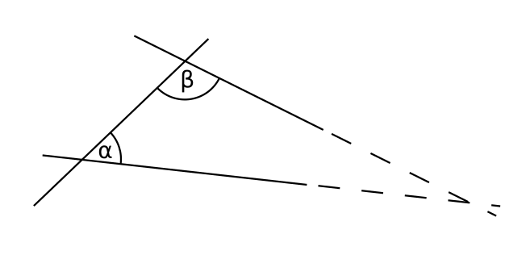

## Table of Contents

1. Introduction
2. The Four Revolutions of Philosophy and the Historical Flow of Modern Philosophy
   2.1. The Four Revolutions of Philosophy: Copernicus, Charles Darwin, Freud, Alan Turing
   2.2. Key Figures of Modern Philosophy: Kant, Hegel, Schopenhauer, Nietzsche
3. Schopenhauer's Philosophy and Its Influence
   3.1. Foundations in Kantian Philosophy and Buddhist Thought
   3.2. The Concepts of Force and Will, and Their Philosophical Influence
   3.3. Critique of Logic
4. The Lack of Philosophy Education in Korea and Schopenhauer's Standing
   4.1. Insufficient Philosophy Education Due to an Excessive Exam-Prep Culture
   4.2. Inadequate Research on Schopenhauer
5. The Future and Schopenhauer
   5.1. Education That Pursues Dreams, Rather Than One That Merely Transmits Knowledge
   5.2. The Growing Importance of Imagination and Creativity

---

### 1. Introduction

With the Fourth Industrial Revolution, what is increasingly valued in people is not mechanical labor but the creative and artistic capacities unique to human beings. And yet Korean universities remain preoccupied with teaching technical skills to boost employment rates, while parents push their children to get ahead by cramming in ever more knowledge. Changing an education system and culture already this entrenched won't happen overnight. But philosophy can offer insight into education that responds not to ten-year cycles of change, but to hundred-year ones. This piece looks at the philosophy of Schopenhauer, who had an enormous influence on modern philosophy, and examines how his thought went on to shape science, literature, and more. Through this, I hope to understand what historical current Schopenhauer's philosophy set in motion, and to use that as groundwork for thinking about the future of education in Korea. That said, this piece is not written with the aim of achieving an expert-level understanding of philosophy; I've tried, as much as possible, to keep it accessible to a general reader. Because of that, there's a real risk that what Schopenhauer truly meant has been distorted somewhat in the process, and I approach this piece with an apology to him in advance on that account. Readers will also get a more accurate understanding by seeking out the original texts or their translations directly.

### 2. The Four Revolutions of Philosophy and the Historical Flow of Modern Philosophy

Before getting into Schopenhauer, let's first look at how philosophy comes to shape human thought, and what philosophical currents Schopenhauer himself was born into.

First, we need to look at the concept of the "four revolutions of philosophy" and the lineage of modern philosophical figures. The concept of philosophy's four revolutions was introduced by Luciano Floridi, currently a professor of philosophy of information and ethics at Oxford University [Author Luciano Floridi (2014-06-23)](https://youtu.be/JGUCOCsSTAE). According to his argument, the four revolutions of philosophy consist of Copernicus (heliocentrism), Charles Darwin (evolution), Sigmund Freud (psychoanalysis), and Alan Turing (the invention of the computer) — each of whom delivered a massive shock to the common assumptions of their era.

**First,** Copernicus broke the geocentric model, in which the stars were believed to revolve around the earth, and argued instead for heliocentrism — that the earth revolves around the sun. At the time, the notion that humanity stood at the center of the world was bound up with the Christian worldview in which God created humanity at the center of the universe, so challenging geocentrism was seen as a dangerous act that threatened to shake that worldview to its core. Fearing the controversy, Copernicus himself delayed publishing his book *On the Revolutions of the Heavenly Spheres* (1543) until the year of his death, thereby avoiding direct punishment. But Giordano Bruno, who took up Copernicus's heliocentrism and went further to argue for an infinite universe, was burned at the stake in 1600, and Galileo Galilei, who backed the theory with observation, was likewise brought before the Inquisition, forced to recant, and spent his final years under house arrest. In this way, heliocentrism was ultimately accepted only after bitter resistance, and became the first event to make humanity realize it was not the center of the world.

**Second,** Charles Darwin proposed the theory of evolution, making what was, at the time, considered an absurd claim: that humans branched off from a common ancestor shared with other animals. Before the theory of evolution, people still held deeply to the Christian idea that humans were special because God had made them in His own image. And the implication of evolutionary theory, in the end, was that humans were not specially created. This was a theory that dealt a serious blow to human pride, and in an effort to deny it, some in Christian circles still try to prove creationism today, without ever managing to provide a clear answer.

**Third** is the psychoanalysis developed by Sigmund Freud, which holds that human behavior is driven not by logic but by libido (sexual energy) and thanatos (aggression, aggressive energy) (Do-eon Jeong, *Freud's Chair*, Woongjin ThinkBig, 2009, pp. 46-48). This cast doubt on human reason itself, and denied the rational, logical capacity for thought that had long been believed to be humanity's unique value — the one thing that set us apart from animals. In other words, humans are not rational, reasonable beings, but ultimately animalistic beings driven by sexual desire and aggression, and what we call our thinking is merely the expression of our nature disguised as reason.

**Finally,** there is the information revolution driven by the computer, led by Alan Turing. During World War II, Alan Turing developed a machine to decrypt the German military's cipher machine. This became the foundation of the computer, and Turing believed this machine could be equipped with the language ability to imitate a human being. This is also the origin of what we now call the Turing Test — the test used today to measure an AI's conversational ability, in which one observes a conversation between an AI and a human and tries to determine which is which. And recently, as AI performance has advanced far beyond what anyone imagined — even winning at Go, a domain once thought to belong exclusively to human intuition, when AlphaGo triumphed — the question of whether machines might one day replace human thinking itself has only grown more pressing.

In this way, even theories that were historically believed to be true were challenged by courageous scientists and philosophers, and after enduring immense persecution and resistance, a new consensus was eventually accepted. This further suggests that humans are not animals that move purely by rationality and reason, but are instead driven by their own beliefs and vested interests — and, further still, that not only our evolutionary form and psychological inner life, but even their very source, may be nothing special.

And in a way similar to this current of revolutions in the philosophical world, the concept of "will" that Schopenhauer proposed refers, in the abstract, to the fundamental driving force behind all life. Among the figures above, Schopenhauer's thought had a particularly strong philosophical influence on Sigmund Freud, and also bears a resemblance to the problem consciousness Darwin raised.

### 3. Schopenhauer's Philosophy and Its Influence

Let's look at the historical currents into which Schopenhauer was born. Before Schopenhauer came **Kant** (Immanuel Kant, 1724–1804), a Prussian philosopher who brought modern Enlightenment thought to its peak and laid the foundation of German idealist philosophy (Wikipedia (ko), "Immanuel Kant" (2024-11-19)). Schopenhauer (Arthur Schopenhauer, 1788–1860) was born after him and was profoundly influenced by Kant's philosophy. Kant made an immense contribution to establishing the foundations of modern philosophy in detail and with clarity. He established numerous concepts, including metaphysics, the thing-in-itself, and transcendental idealism, and left behind numerous works such as the *Critique of Pure Reason*, the *Critique of Practical Reason*, and *Logic*. Research on Kant in Korea dates back to the period when Western philosophy first began flowing into the country, thanks to the contributions of Lee Jeong-jik (李定稷, 1841–1910). Later, Hegel (Georg Wilhelm Friedrich Hegel, 1770–1831) took up Kant's philosophy and established the concepts of logic and dialectics, but Schopenhauer despised Hegel's philosophy, and the two clashed repeatedly, with Schopenhauer calling the philosophers of the day frauds who deceived the public to earn a living. At just thirty years old, Schopenhauer completed *The World as Will and Representation*, the masterwork of his life, though it sold poorly at the time. He later became a university professor, but deliberately scheduled his lectures at the same time as Hegel's; when too few students showed up, he taught for only a single semester before storming out of the university to pursue his research alone. Fortunately, Schopenhauer's achievements were finally recognized and he began to gain fame around the age of sixty, and he recorded the following in his own work, *The World as Will and Representation*:

> I too have finally reached that age, and now, at the tail end of my life, I feel a sense of satisfaction seeing my work begin to take effect — and given the customary pattern of the past, I harbor the hope that, having begun so late, it will endure all the longer.  — A. Schopenhauer, trans. Hong Seong-gwang, *The World as Will and Representation* (revised and expanded edition), Eulyoo Publishing, 2015, p. 36 — from the "Preface to the Third Edition"

Unlike the logic-based philosophy that came before him, Schopenhauer explained the world through a new concept: the "will to life" (*Wille zum Leben*). Put briefly, the philosophy contained in *The World as Will and Representation* is this: "every phenomenon is a representation in which the blind will to life reveals itself." In Schopenhauer's philosophy, desire arises and manifests through *Wille* (translated as "will," though the concept encompasses sexual desire, aggression, and vital force all at once). And the a priori truth we can attain (meaning truth obtainable prior to experience) is that human beings do not know the world as it truly is — we possess only the sensory organs through which we perceive it — and the world exists only as a subjective "representation" (*Vorstellung*). Here, representation corresponds, in psychological terms, to an individual's "idea." Hegel, by contrast, argued that the pursuit of truth requires the process of thesis-antithesis-synthesis, which is even defined in the dictionary as: "<Philosophy> The three stages of dialectical logic as formulated by Hegel — namely, the process by which a thesis (正), and an antithesis (反) that contradicts it, are integrated into a higher, synthesizing claim, the synthesis (合)." (National Institute of Korean Language, Standard Korean Dictionary, "正反合").

Taken together, Hegel's method arrives at truth through a logical, deductive approach, while Schopenhauer's method arrives at truth instinctively and non-logically, through intuition. Many people would not easily agree with Schopenhauer's view here, since most of us have passively received knowledge handed down to us by others, learning continuously through instruction. And yet people who come up with creative, unexpectedly ingenious ideas often resemble Schopenhauer's philosophy quite closely. That's because historically significant scientific inventions and literary works are, in a great many cases, arrived at not through a gradual, logical process but through momentary, dynamic flashes of inspiration. Consider, for instance, futurist Ray Kurzweil's claim that because no one can predict the future, humanity's rate of technological advancement is not gradual but explosively unpredictable at every turn, and that by 2045 we will reach a singularity at which artificial intelligence surpasses human intelligence (Ray Kurzweil, *The Singularity Is Near*, Viking, 2005). Schopenhauer's concept of the "will to life" would later have an enormous influence on Nietzsche (Friedrich Wilhelm Nietzsche, 1844–1900) as he formulated his own concept of the "will to power" (*Wille zur Macht*). After reading *The World as Will and Representation*, Nietzsche wrote the following:

> "Every sentence cried out refusal, negation, renunciation. In this book I encountered a mirror in which I saw the world, life, and my own temperament. It was truly a remarkable encounter. I saw the flower of an art with no tendentiousness whatsoever, and I saw sickness and cure, exile and refuge, hell and heaven. A hunger for self-knowledge came flooding in." — Friedrich Nietzsche

As explained above, Schopenhauer's philosophy is fundamentally grounded in Kant's philosophy — to the point that he wrote the following in *The World as Will and Representation*:

> In truth, the effect that reading Kant's principal work has on the mind can be compared to that of a blind man undergoing cataract surgery. (...omitted...) Kantian philosophy is the one philosophy that must be thoroughly understood as a precondition for expounding the thought developed here.  — A. Schopenhauer, op. cit., pp. 14–18 — from the "Preface to the First Edition"

> Anyone who has not made Kantian philosophy their own remains, no matter what else they go on to study, in a state of innocent, naive realism — the same childlike state of nature we are all born into.  — A. Schopenhauer, op. cit., p. 29 — from the "Preface to the Second Edition"

Schopenhauer was deeply immersed in the nihilistic strands of Buddhist thought, and this played a major role in infusing Western philosophy with a Buddhist perspective, giving rise to a distinctly Western form of nihilism. Nietzsche can be seen as having later taken this up and brought it to completion. Nietzsche's famous declaration that "God is dead" was not a mere joke, but a rejection of metaphysics — "metaphysica literally means 'that which is beyond form,' 'that which lies beyond the sensible,' or in other words, the study of what lies on the far side of nature. By its very name, metaphysics is 'the study of the supersensible' — that which lies beyond nature, the totality of objects of experience." (Immanuel Kant, trans. Baek Jong-hyeon, *Critique of Pure Reason 1*, Acanet, 2006, p. 26) — that is, a rejection of any philosophy concerned with a world of gods (absolute truth) beyond the human world, and instead an embrace of the idea of the Übermensch, who pursues self-overcoming on their own terms. Just as Buddhism seeks liberation through ascetic practice amid suffering, Schopenhauer argued that one could further develop oneself by mastering the impulsive, endlessly craving will to life — and this can be seen as having had a major influence on Nietzsche's nihilism.

Schopenhauer explained phenomena through the concepts of force and will. In particular, will (*Wille*) is "a concept that encompasses not only its ordinary meaning, but also humanity's other blind sensibilities — 'desire,' 'craving,' 'pursuit,' 'striving,' and 'obstinacy.'" (Wikipedia (ko), "The World as Will and Representation" (2017-06-21)) Schopenhauer also explained a wide range of natural phenomena through the concept of will. Regarding the human body, for instance, in chapters such as "The Relationship Between Body and Will," "The Body as Will and Representation," and "The Body as the Manifestation of Desire," he explains that the body developed as a manifestation of will (A. Schopenhauer, op. cit., pp. 185–199) — a view that resonates, in certain respects, with the problem consciousness that evolutionary theory would later raise. And in chapters such as "The Madness of Creative Genius," "The Artist and the Work of Art," and "The Subjective Conditions for Experiencing Aesthetic Satisfaction," he regarded art as a concentrated expression of will and placed great value on it (A. Schopenhauer, op. cit., pp. 308–333). Music, in particular, he considered a language comprehensible across the entire world, unbound by the constraints of time, containing a will that transcends space and time itself (Wikipedia (En), "Arthur Schopenhauer" — Art and aesthetics (2017-06-21)).

Schopenhauer also leveled harsh criticism at logic. He wrote that "logic is never truly useful in practice, and philosophy holds only a theoretical interest in it, so there is no need to commit these rules to memory" (A. Schopenhauer, op. cit., p. 105), and that "the only case in which logic can actually be put to practical use in a debate is not so much when actually proving your opponent's conclusion to be wrong, but rather when pointing out and proving, in technical terms, that their reasoning was deliberately fallacious" (A. Schopenhauer, op. cit., p. 108). In his own work *The Art of Being Right*, he lays bare, in exhaustive detail, just how far people will go — deploying sophistry, cunning, and deception — while disguising themselves as rational in order to win an argument.

> I shall now present debating techniques that pay no regard to whether one is objectively right or wrong — because no one can ever know for certain what the objective facts of a matter are. That can only be settled once the debate itself has concluded.  (A. Schopenhauer, trans. Choi Seong-uk, *The Art of Being Right*, One & One Books, 2016, p. 20) — from *The Art of Being Right*

More than anyone, he criticized logical thinking, and held that such dialectical reasoning could never yield truth. Remarkably, this way of thinking extended even into mathematics — Schopenhauer criticized Euclid's parallel postulate. The parallel postulate is the seemingly self-evident mathematical proposition that, in the figure below, "if α + β < 180°, then the two lines will eventually meet at a point." But Schopenhauer criticized this as an instance in which logical reasoning was applied in an absurd way, calling it an incomplete definition lacking certainty (Wikipedia (En), "Arthur Schopenhauer" — Mathematics (2017-06-21)). In fact, this postulate was later shown to be independent of the others in non-Euclidean geometry, and it does not hold in the curved spacetime described by Einstein's general theory of relativity (1915). Schopenhauer had raised this very issue long before such discussions became mainstream.

Schopenhauer's concept of will — the idea that one could move beyond logic and mathematics, which only explain the visible, realist world, and instead arrive at objective truth about a world that exists as representation — later made a major contribution to Heidegger's philosophy as well (Dale Jacquette, *Philosophy and the Arts*, Cambridge University Press, 2007, pp. 162–171). Even in Heidegger's hermeneutic circle, arriving at deeper truth relies not on a deductive method but on a model that circulates between the objective and the subjective — a model that also influenced how he went on to develop his concept of ontology.

To summarize the fields and figures Schopenhauer influenced: in philosophy, he had a direct influence on Nietzsche and Wittgenstein, and an indirect influence on Heidegger within modern philosophy. In political philosophy, he influenced John Rawls; in literature, a wide range of writers including Tolstoy, Thomas Mann, and Kierkegaard; in psychoanalysis and psychology, Carl Jung and Sigmund Freud; and in science, Albert Einstein and Erwin Schrödinger. Countless other figures, beyond these, have referenced Schopenhauer and sought to carry on his teachings in their own fields. And yet in Korea, Schopenhauer is mostly known — if he's known at all — as "the pessimist philosopher" or "the misogynist," when he's recognized at all. Looking back on my own undergraduate education at KAIST, a great deal of it was centered on the transmission of knowledge, and professors who stepped outside the framework of the course to share their own philosophy were rare, and tended to be older professors when they did exist. This may well be a subjective impression of my own, but because the structure of undergraduate education itself places its weight on producing specialists and transmitting advanced knowledge, there was very little room left over to convey what actually matters most: the purpose of study itself, a spirit of service to humanity, and an attitude toward life that pioneers truth by following one's own beliefs and convictions regardless of temptation.

> University philosophy always makes its way forward cautiously, carrying a hundred intentions and a thousand motives, ever mindful of fear of the sovereign, the will of the government, the doctrines of the established church, the wishes of publishers, the approval of students, the goodwill of colleagues, the trends of the times, the fleeting inclinations of the public, and everything else besides.  — Schopenhauer (A. Schopenhauer, trans. Hong Seong-gwang, *The World as Will and Representation* (revised and expanded edition), Eulyoo Publishing, 2015, p. 33)

Perhaps, as Schopenhauer said, the university is simply not adequate a place for the pursuit of truth. Schopenhauer, in the end, stormed out of the university to conduct his research on his own; Nietzsche, too, wrote his masterpiece *Thus Spoke Zarathustra* only after resigning his university professorship. Wittgenstein is said to have felt that Cambridge, where he worked at the time, "was full of university researchers striving to appear clever without having any profound thoughts at all" (Wikipedia (ko), "Ludwig Wittgenstein" (2017-06-21)), and withdrew into solitude as a result. Though these historical figures were, in the end, unable to overcome the constraints of their era and left the university altogether, I believe we bear a responsibility, for the sake of future generations, to improve the education of the present. One reason Nobel Prizes remain rare in Korea may well be a tendency to try to understand every phenomenon only through a logical, realist lens. The kind of one-directional, rote-based education we have now, a system that cultivates only memorization and computational skill, and a conservative atmosphere among professors and the education establishment, all work together to crush a student's will to attempt anything new or creative, and instead turn them into beings who simply conform to the system. Talent cultivated by this kind of education remains stuck in short-sighted thinking, capable of handling only immediate problems, and struggles, for lack of insight, to build a life amid what is yet to come. Such people end up moving, again and again, according to others' opinions, prevailing trends, and popularity — living someone else's life rather than their own. As Erich Fromm once put it, "In the nineteenth century, the problem was that 'God is dead'; in the twentieth century, the problem is that 'man is dead.'" (Erich Seligmann Fromm, trans. Kim Byeong-ik, *The Sane Society*, Bumwoo-sa, 1999)

### 4. The Lack of Philosophy Education in Korea and Schopenhauer's Standing

In this way, education in Korea allots far too little time to philosophy education. This is likely because educators tend to think of "studying" simply as the transmission and reception of knowledge. But in the twenty-first century, knowledge is something anyone can easily access through books or the internet, without ever needing a university at all. And yet many universities still cling to their old, conservative methods, taking for granted an inefficient system that requires students to complete a fixed set of courses every semester. Philosophy education, in particular, is not something one gains simply by reading books at random. It comes from discussing and communicating with a wide range of people and arriving at insight through that process — and that kind of insight carries far more value for a person's life than knowledge alone ever could. Arriving at that kind of insight requires not sitting at a desk memorizing facts and doing calculations, but new ways of thinking and diverse experience. By encountering many different people and broadening the individual perspective each person brings to the world, we need to cultivate the creativity and insight required to solve the problems humanity will face in the future. Today's universities should focus not merely on producing technicians, but on cultivating entrepreneurs, leaders, and educators — and KAIST, in particular, should encourage undergraduates to dream bigger and to develop a sense of responsibility for their own lives. Rather than burdening students with GPA pressure, universities should build expertise in a way that lets each person's particular strengths and individuality shine.

We also need to bring more of Schopenhauer's or Kant's metaphysical perspective into how philosophy is taught in Korea. Research on Schopenhauer remains quite underdeveloped here. In fact, Schopenhauer's critique of Kantian philosophy — an important section he included as an appendix to *The World as Will and Representation* — was only translated by Hong Seong-gwang in 2015. Beyond that, publishers have mostly translated Schopenhauer's more accessible, popular self-help-style books, such as *There Is No Love* or *The Art of Being Right*, while research into his more important philosophy of will and his major essays remains lacking. Even within academia, self-proclaimed Schopenhauer experts frequently interpret him through their own subjective lens, which is part of why so many people still think of him purely as a pessimist or nihilist. But Schopenhauer's philosophy carries enormous significance and represents a genuine departure from prior philosophical convention, in that it used the concept of will to shake, from its very foundations, the existing philosophical assumption that truth could only be pursued by viewing the world logically. Even in the broader academic atmosphere — at KAIST, for instance, the focus is on teaching logical thinking through mathematics and engineering — but in reality, historically significant events in the world of science are, more often than not, discovered in a sudden, unpredictable way. As Schopenhauer put it, truth, in practice, is discovered not through a deductive process but through will — impulsive and unpredictable. Past knowledge, therefore, should be used, but never believed to be absolute truth. Knowledge changes constantly across eras, as will itself continues to develop, and there's very little chance that what we're taught today will still be accepted as settled fact a hundred years from now. In this sense, the education of the future needs to move in a direction that places greater emphasis on Schopenhauer's perspective. Existing philosophy education still leans heavily toward rote memorization. But the goal of philosophy education isn't knowing difficult concepts — it's building the mental fortitude needed to work through life's problems when new challenges arise. Schopenhauer once remarked, regarding reading, that "if you simply read too many books, you end up submitting not to your own thinking, but to the thinking of others." Genuine philosophy education shouldn't mean reading indiscriminately and submitting to other people's thoughts — it should help a person cultivate thoughts of their own. That's exactly why discussion-based classes and creativity-focused education matter so much.

We also need to seriously consider cutting back on the excessive amount of technical skill and knowledge crammed into university education. Part of why students in engineering — including at KAIST — carry such a heavy academic burden today is that the bar companies set for the talent they want is simply set too high. To save money, companies offload onto universities the energy they should be investing in shaping the talent they want, and as a result, universities try to cram far too many fields of knowledge into their students all at once. The result is that some students go through life carrying around knowledge they will never use even once. This is a loss for the nation as a whole, and far too heavy a burden for students individually. The volume of material covered in a university education isn't really what matters. What a university should do is instill confidence in its students — the strength to adapt to and overcome whatever life throws at them after graduation, without being easily discouraged, no matter what role they end up taking on. It may sound like a cliché, but a university ought to instill dreams and hope in its students. The hope that anyone can become what they want to be is what fuels a life — and that role is worth far more than knowledge could ever be.

### 5. Conclusion — The Future and Schopenhauer

Imagination and creativity are becoming ever more important for the future. The mechanical tasks people once performed are, one by one, being taken over by machines and artificial intelligence. As a result, the domain in which humans can hold onto unique value distinct from machines is the creative and artistic realm. And this aligns all the more closely with the very thing Schopenhauer pursued: recognizing the will to life and learning to master it. This is precisely why Schopenhauer's philosophy should be embraced with even greater importance going forward. In this piece, I've examined how philosophy shapes human thought, and how Schopenhauer's philosophy, in particular, has influenced humanity. Building on Schopenhauer's philosophy, we should search for better ways to educate the generations that follow us — and rather than stopping at reforming today's exam-prep methods, we should be discussing and designing an education that looks a hundred years ahead.

#### References
1. A. Schopenhauer, trans. Hong Seong-gwang, *The World as Will and Representation* (revised and expanded edition), Eulyoo Publishing, 2015
2. Do-eon Jeong, *Freud's Chair*, Woongjin ThinkBig, 2009
3. Ray Kurzweil, *The Singularity Is Near*, Viking, 2005
4. Dale Jacquette, *Philosophy and the Arts*, Cambridge University Press, 2007
5. Erich Seligmann Fromm, trans. Kim Byeong-ik, *The Sane Society*, Bumwoo-sa, 1999
