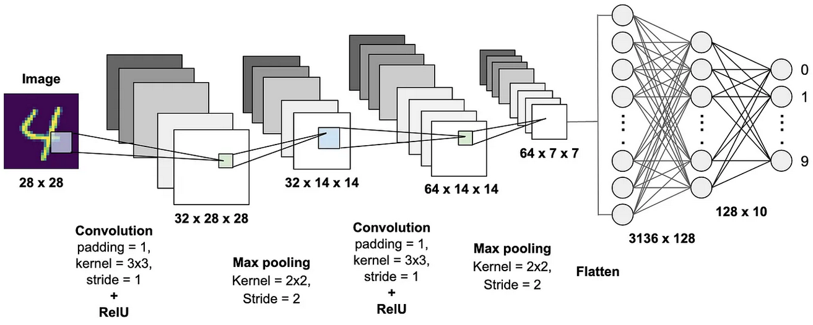

This essay encapsulates reflections from my doctoral program, which I believe may hold greater value than the core argument of my dissertation. While methodologies may evolve, the philosophical contemplations expressed here represent a culmination of my lifelong efforts. I hope that those seeking answers to similar challenges may find resonance in my voice, much like Schopenhauer aimed to convey messages for future generations.

## Urban Space Robot

What is an Urban Space Robot? Unlike passive machines programmed for specific tasks, these robots autonomously provide solutions to resolve urban challenges. An Urban Space Robot aims to prevent excessive urbanization, construct necessary buildings, and devise continuous solutions for the well-being of urban residents.

An Urban Space Robot resembles a balanced living organism, managing factors like population density, traffic, and energy use efficiently. With advancements in edge/cloud technologies, IoT devices such as smart traffic cameras and electric vehicles will generate vast amounts of spatiotemporal urban data. Understanding and processing this data will be facilitated through the Urban Embedding proposed in my dissertation, which will integrate into various deep learning-based AI applications.

## The City as Will and Representation

Arthur Schopenhauer’s work, *The World as Will and Representation*, has significantly influenced my thinking. He proposed that the world can be understood through two concepts: representation and will.

**Representation** encompasses everything perceived through our senses. For instance, when seeing a number, our visual signals are converted into neural signals that our brain deciphers. Schopenhauer viewed these stages of perception as representations, akin to how deep learning models process data.

Conversely, **Will** extends to desires, cravings, and pursuits. For instance, the strong will of people drawn to urban areas can be observed in data about human movement, such as in MIT’s Senseable City Lab studies.

When examining cities through the lens of representation and will, distinctions between Asian and European cities become apparent. Asian cities often prioritize convenience and efficiency, assessed through material figures. In contrast, European cities emphasize beauty, history, and individuality, respecting the unique wills of their citizens.

This writing reflects my experiences in Korea, where individuality and will often feel diminished. It is a reminder that pure will is essential in fields contributing to humanity, such as science.

In conclusion, deep learning, the methodology utilized in my research, can only address issues within the realm of representation. Its limitations are evident, as AI cannot truly comprehend subjective preferences, such as personal tastes in music or art.

## Contribution as a Computer Scientist

Researching urban dynamics is complex, as it intertwines politics, economics, culture, and race. Establishing causality among correlated variables is challenging, and understanding cities requires both quantitative and qualitative indicators.

As a computer scientist, my contribution lies in interpreting qualitative meanings from urban data and addressing issues through engineering solutions. Scientific artists can empathize with social issues and create works that facilitate dialogue, while engineers can build systems that effectively tackle urban challenges.

For instance, the traffic prediction model I developed highlights the importance of refined data. Without proper foundations, urban AI applications risk producing unreliable results. It’s essential to recognize that while quantitative metrics like Mean Absolute Error provide insights, they do not capture qualitative satisfaction.

Ultimately, urban space robots should prioritize the qualitative experiences of residents. A thriving city is defined not by metrics, but by the richness of community interactions and the happiness of its inhabitants. We should strive for urban environments where people can communicate, support one another, and collaboratively address societal issues.
