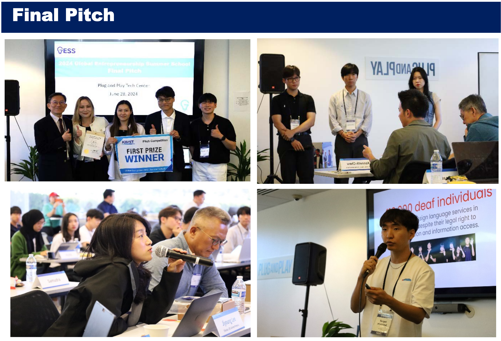
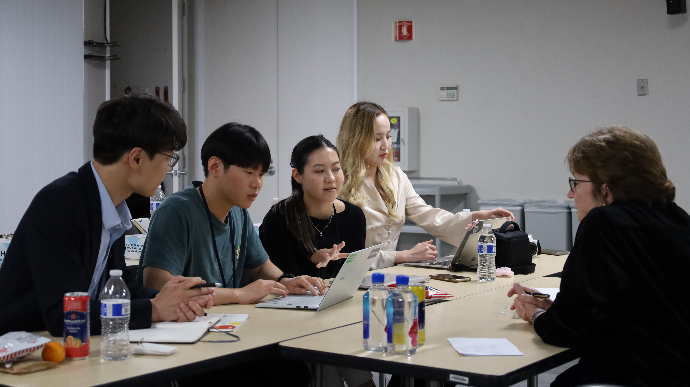
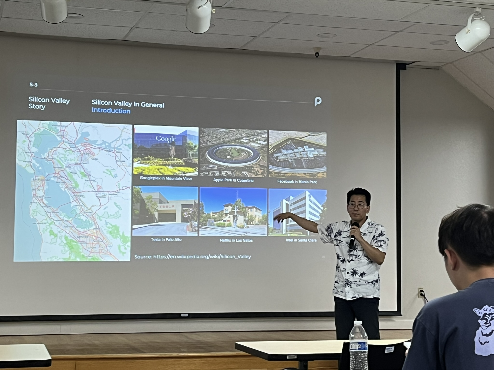
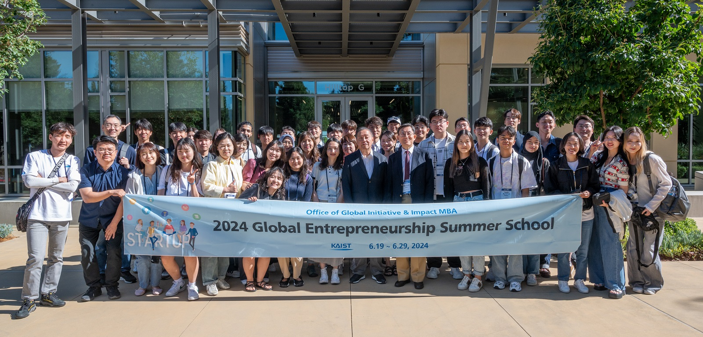

The GESS program has been an incredible opportunity for me.

I have been involved with Computer Science since high school, and I was always inspired by founders like Mark Zuckerberg of Facebook and Bill Gates of Microsoft, who took the leap into building their companies while still in college. From the moment I entered KAIST as an undergraduate, I dreamed of starting a business through entrepreneurship programs and startup internships. At the time, however, Korea's corporate culture, its investor–founder dynamics, and the maturity of its stock and M&A markets still felt less developed than what unicorn companies typically need to emerge. As a result, even while pursuing my Ph.D., I continued to dream of building such a startup.

▲ Pitching at [Plug and Play Tech Center](https://maps.app.goo.gl/k1xD1EmikVXVGwtq5) -- Judges [Daniel Idzkowski](https://www.linkedin.com/in/danielidzkowski/), [Kenneth Chew](https://www.linkedin.com/in/kenc338/), [Jay Eum](https://www.linkedin.com/in/jayeum/),  Jiyoung Lee, [Tae Hea Nahm](https://www.linkedin.com/in/tnahm/)

Even during my Ph.D., I took part in hackathons and entrepreneurship events whenever I could, keeping that dream alive. My research, too, aimed at practical applications and potential collaborations with companies rather than papers alone. As my graduation approached, I learned about the GESS program and applied without hesitation, feeling it was meant to be. There I met passionate and generous teammates like [Merey](https://www.linkedin.com/in/merey-makhmutova-73981a216/), [Alina](https://www.linkedin.com/in/alina-akhmetbek-b64105308/), [Sejun](https://www.linkedin.com/in/sejun-jung/), and [Jaywoong](https://www.linkedin.com/in/jaywoong-jeong/). Through market research, we developed the idea of a service to help immigrants navigate visa issues. Across many interviews and mentoring sessions, we received feedback on how to communicate our business idea and pitch effectively, and we ultimately won the competition.

▲ Mentoring Session with [Michelle Lane Messina](https://www.linkedin.com/in/michellemessina/) at [KOTRA Silicon Valley](https://maps.app.goo.gl/6R6nnRUohZ4BjYVP7).

Throughout this process, our team collaborated to put ideas forward as equals and to refine our service through consensus. There were a few disagreements, but they came not from personal pride but from a genuine wish to steer the team in a better direction. When a team relies on a single person to make every decision—even someone with a Ph.D. or a distinguished career—it may improve accuracy in some cases, but it offers no guarantee that person will always be right. It can also place undue pressure on them to avoid mistakes and make them hesitant to take risks. When everyone contributes ideas and decisions are made together, there is less fear of failure; the team can lean on one another and make up for each other's weaknesses. I believe entrepreneurship is about advancing finance, technology, and culture together toward a more developed world. This is why, as many senior Korean entrepreneurs have described, Silicon Valley remains such an appealing environment for those drawn to startups.

▲ Lecture from CEO of [Phantom AI](https://phantom.ai/), [Hyunggi Cho](https://news.mt.co.kr/mtview.php?no=2015120708040367115).

I believe it is possible to build something like Silicon Valley in Korea as well. Korea currently faces various social challenges—such as low birth rates and tensions between social groups—that appear to stem from a mix of structural factors, including an industrial landscape centered on large corporations and the heavy concentration of resources in the metropolitan area. At the same time, Korea is relatively open to immigrants and to cultures from abroad, and I see meaningful potential in that openness. Just as Silicon Valley has contributed to the growth of the U.S. in no small part thanks to talented immigrants, I believe a similar model could take root in Korea. In this sense, the GESS program at KAIST may offer a glimpse of the future of Korean corporate culture. I hope that, in the years ahead, a future will take shape in which talented people from around the world can build their lives and work happily in Korea.

▲ Picture with CEO of [Broadcom](https://www.broadcom.com/),  [Hock Tan](https://news.kaist.ac.kr/newsen/html/news/?mode=V&mng_no=35110&skey=keyword&sval=Hock+Tan&list_s_date=&list_e_date=&GotoPage=1) (Honorary Doctorates of KAIST).

---

#### Additional Materials

* [GESS 2024 Report](./2024_GESS_Report.pdf)

* [KAIST NEWS](https://news.kaist.ac.kr/newsen/html/news/?mode=V&mng_no=37970)
