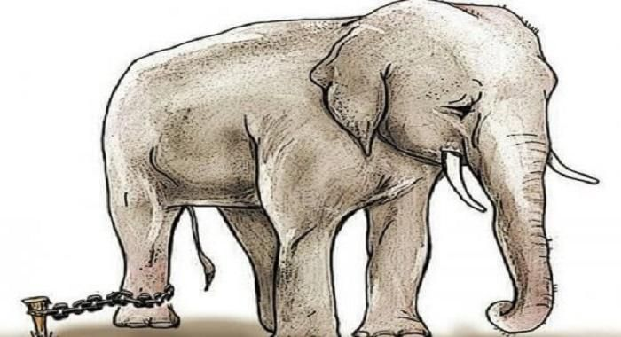

There was a day recently when it rained heavily.

That day, I had just finished a sauna session and was on my way out. After my bath, I stepped outside, and the sky was pouring rain. For some reason, I didn’t care about the rain. Whether it was because I had something weighing on my mind or perhaps a desire for some kind of change, I walked without using an umbrella. Everyone around me was using umbrellas, but I walked through the rain, oblivious to it.

The rain came down quite heavily, and my clothes—from my jacket to my pants—became soaked. Strangely, though, I didn’t feel anything. Instead, I wondered if, just as we fear the rain, we might be living our lives fearing the world too much.
I think startups are like walking on a rainy day. We move forward, believing that a path exists. But in reality, the paths we talk about are ones that are created through human systems and rules. It’s when we step outside of these systems that true courage is required, and that’s why we call such ventures “innovative” and label them as “startups.”
And yet, we fear walking that path simply because it’s raining. It’s as if we’ve been taught since birth that we can’t walk in the rain without an umbrella. The truth is, we were born capable of walking in the rain without one. But society has constantly told us that walking in the rain without an umbrella is dangerous, and before we knew it, we started to believe it.

This reminds me of a similar story. Fleas that are kept under a bottle cap for several days will no longer jump higher than the height of that cap. And a baby elephant that grows up tied with a rope will not attempt to break free, even when it becomes an adult. Humans, too, adapt to the environments they are given.

However, humans have something else: imagination. This imagination is a special power, along with the ability to express it through language. I believe this imagination is a gift of the Holy Spirit that God has given to humans. In philosophy, this is referred to as being “a priori”—things we know without experience, like the innocence felt in Mozart’s K.545 or the moment when a baby begins to walk on two legs. Perhaps this imagination is an a priori ability, a wisdom God reveals to us.
