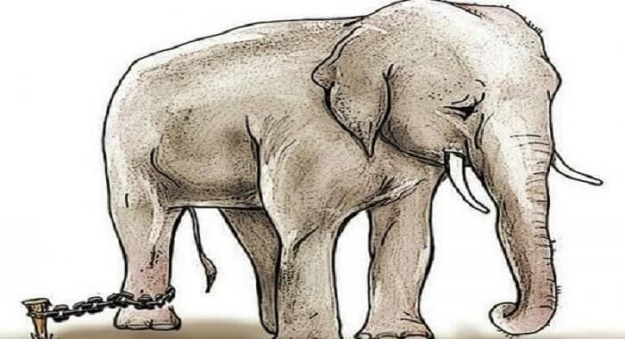

There was a day recently when it rained heavily.

I had just finished a sauna and was on my way out. When I stepped outside after my bath, the sky was pouring. For some reason, the rain didn't bother me. Maybe it was because something was weighing on my mind, or maybe I was quietly hoping for some kind of change—either way, I walked without an umbrella. Everyone around me was holding one, but I walked on through the rain, hardly noticing it.

The rain fell hard, and everything from my jacket to my pants grew soaked. Strangely, though, it didn't trouble me at all. Instead, I began to wonder: just as we fear the rain, might we be living our lives fearing the world a little too much?

I think a startup is like walking on a rainy day. We move forward, trusting that a path exists. But in truth, the paths we usually speak of are ones carved out by human systems and rules. It is when we step beyond those systems that real courage is required—and that, perhaps, is why we call such ventures "innovative" and give them the name "startups."

And yet we hesitate to walk that path simply because it's raining. It's as though we've been taught since birth that we cannot walk in the rain without an umbrella. The truth is, we were born perfectly able to. But the world kept telling us it was dangerous, and before we knew it, we came to believe it.

This brings to mind a couple of familiar stories. It's often said that fleas kept under a bottle cap for several days will no longer jump higher than that cap, even after it's removed. And there's the tale of a young elephant raised tied to a rope, who never tries to break free even once it has grown strong enough to do so. In a similar way, we humans, too, adapt to the environments we are given.

But humans have something more: imagination—and the ability to give it shape through language. I believe this imagination is a gift of the Holy Spirit, something God has granted to us. It feels almost like the kind of knowledge philosophers call "a priori"—something we seem to carry within us before any experience, like the innocence one senses in Mozart's K.545, or the moment a baby first rises onto two feet and walks. Perhaps this imagination, too, is a wisdom given to us from the very beginning.
