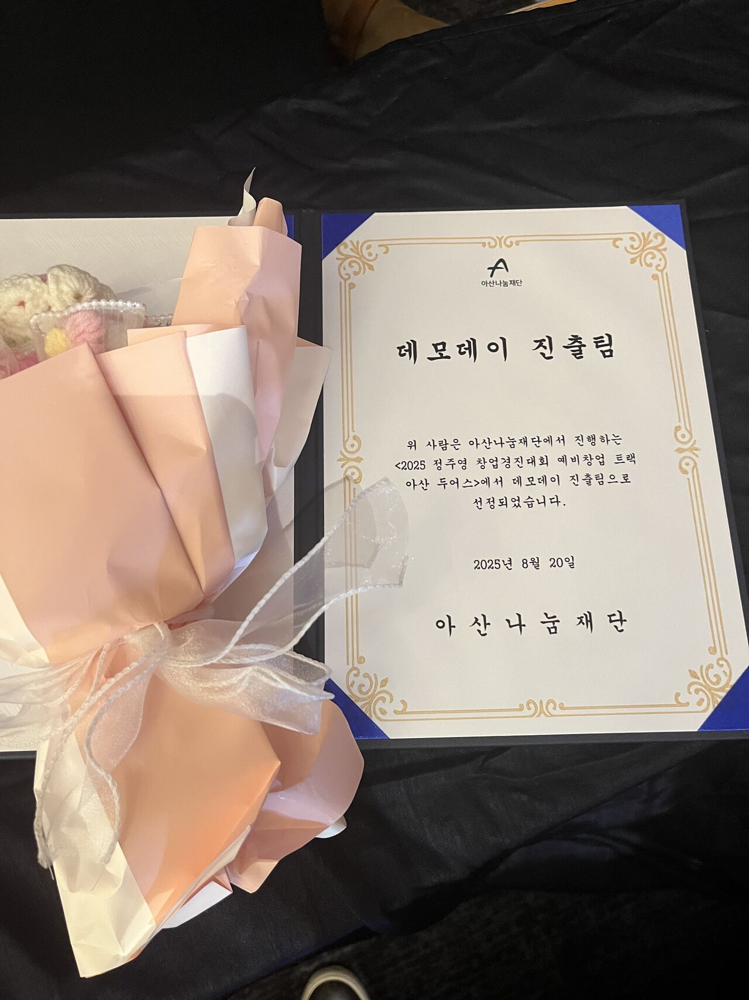
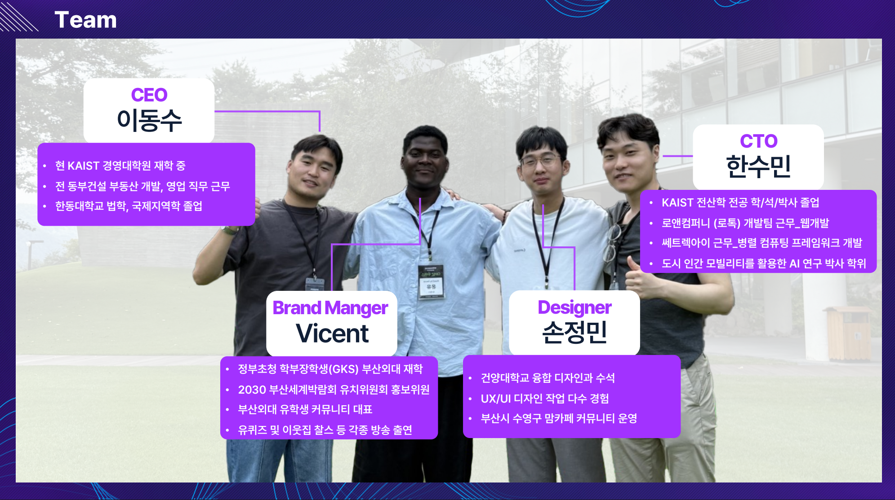

The Divercity House team has been selected as one of the **seven finalist teams** for the *Chung Ju-Young Startup Competition Demo Day* 🎉 (out of 27 teams in the preliminaries).

Over the past two months, we commuted every Friday between **Busan** and **Seoul MARU180**, refining both our product and our marketing. During the IR pitching, rather than focusing solely on technical features, we highlighted our mission: **to build a fair and trustworthy housing and settlement solution for foreigners**. This allowed us to convey not just technology, but also the problem awareness and values behind our work, which resonated with many.

▲ Award at the IR Pitching Session, Chung Ju-Young Startup Competition

This achievement carries personal meaning for me as well. During my Ph.D. studies at KAIST, I researched **urban human mobility AI**, always dreaming of one day building a startup that could analyze real customer data and generate meaningful value. Through this project, that dream took a concrete step forward.

We also witnessed **small but meaningful changes**. More than *50 tenants* who signed leases through our service are now actively sharing updates and supporting one another in our community chat room. Seeing this convinced me that our CEO's sincere **customer-first philosophy** was taking real shape.

▲ Our Team (Divercity House)

My gratitude goes to **CEO Dong Soo Lee, designer JeongMin Sohn, and global marketer Vicent Segura Bilekera** for their dedication. Special thanks as well to **Asan Doers** for organizing this invaluable opportunity, and to the **UD Impact coaches** for their guidance and support.
