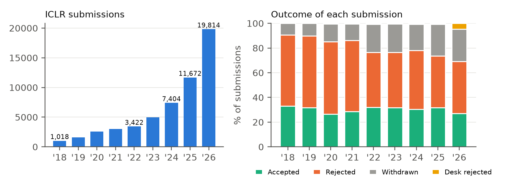
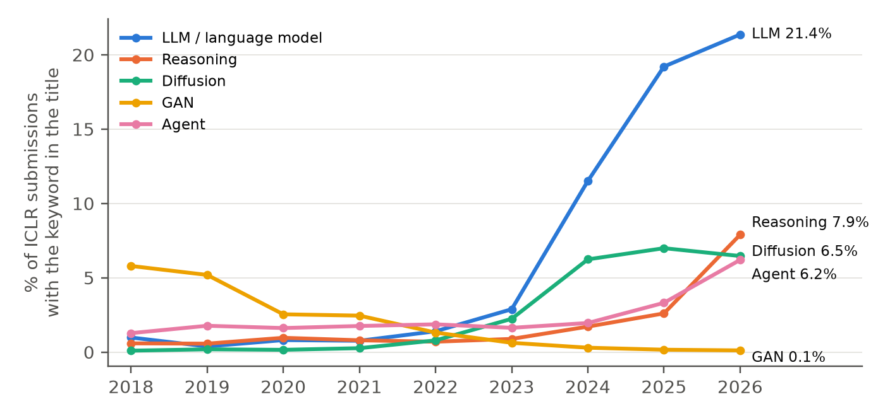
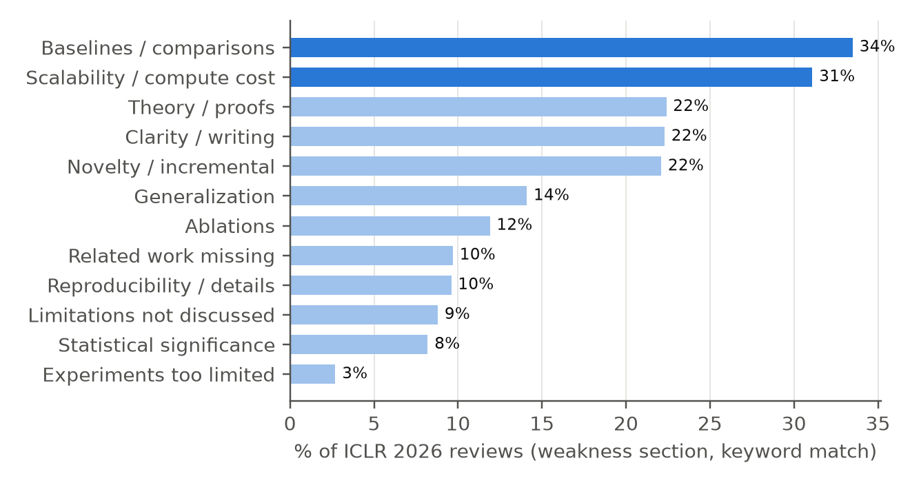
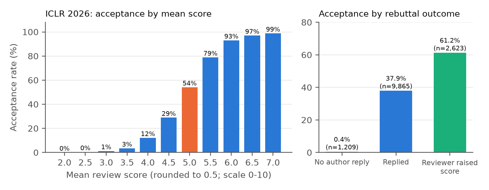
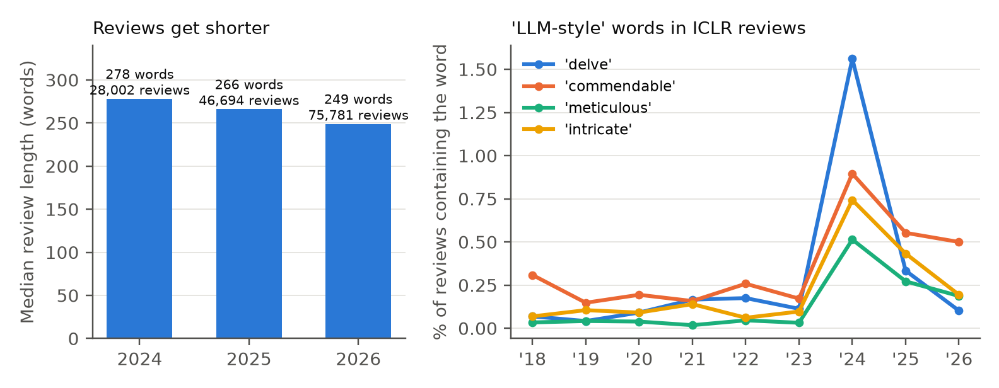

**TL;DR.** I downloaded every public review on OpenReview for the three largest machine-learning conferences: **84,212 papers and 322,903 reviews** from ICLR 2018–2026, NeurIPS 2021–2025, and ICML 2025–2026. Six things stood out.

1. ICLR submissions grew **19-fold in eight years**. Almost a third of 2026 submissions were withdrawn or desk-rejected before a decision.
2. One in five ICLR submissions now has **"LLM" or "language model" in the title**, up from 1% in 2018. Those papers are accepted at **exactly the average rate**.
3. The most common weakness reviewers write down is **missing or weak baselines (34%)**, ahead of novelty (22%).
4. At ICLR 2026, a **mean score of 5.0 meant a 54% chance** of acceptance. Each half point near the threshold was worth about **25 percentage points**.
5. Only **5 of 1,209** decided papers without any author reply were accepted.
6. The word **"delve"** appeared in reviews nine times more often in 2024 than in 2022, and then dropped back.

The full write-up with methods and limitations is available as a working paper: **[PDF](han2026aireviews.pdf)**. If you prefer to watch, here is a five-minute video version:



---

## Why look at reviews at all?

Every researcher in machine learning has a peer-review story. Usually it involves a reviewer who seemed to have read a different paper. The conversation tends to stay anecdotal, but it no longer has to. [OpenReview](https://openreview.net) publishes reviews, scores, author responses, reviewer follow-ups, and final decisions for many major venues. At ICLR, this includes rejected and withdrawn papers.

So I asked four questions that I, and many graduate students I know, actually care about:

- **What are people submitting**, and how fast is that changing?
- **What do reviewers object to** most often?
- **What score is "enough"?**
- **Does the rebuttal matter?**

Along the way I also looked at the reviews themselves: how long they are, and whether they show the vocabulary fingerprints of LLM-written text.

## The data

| Venue | Years | Papers | Reviews | What is public |
|---|---|---:|---:|---|
| ICLR | 2018–2026 | 55,472 | 209,348 | every submission, including rejected and withdrawn |
| NeurIPS | 2021–2025 | 18,763 | 75,254 | accepted + rejected papers whose authors opted in |
| ICML | 2025–2026 | 9,977 | 38,301 | accepted + rejected papers whose authors opted in |
| **Total** | 16 venue-years | **84,212** | **322,903** | |

I used the OpenReview API to download each submission's title, abstract, keywords, and every reply: reviews, meta-reviews, decisions, author comments, reviewer comments, and withdrawal notices. I did not download any PDFs. Collection finished on October 7, 2026.

**Why mostly ICLR?** At NeurIPS and ICML, about 95% of the papers with public reviews are accepted. That reflects the publication policy, not the real acceptance rate. Comparing accepted and rejected papers there would be misleading, so every statistic that needs both groups uses ICLR, where the whole population is public.

## 1. Growth, and a third of submissions that are never decided

ICLR received **1,018 submissions in 2018 and 19,814 in 2026**. Growth has accelerated rather than slowed: the last two cycles grew by 1.6× and then 1.7×.

The acceptance share has stayed inside a narrow 26–33% band the whole time. What changed is the part of the bar that never reaches a decision. In 2026, **26.3% of submissions were withdrawn and 4.6% were desk-rejected**. Desk rejections went from 53 in 2024 and 71 in 2025 to **908 in 2026**. Almost one submission in three now leaves the process before a final decision.

## 2. Topics: LLMs everywhere, and GANs nowhere

I matched simple keywords against paper **titles**. A title is a decent proxy for how authors want their work to be seen.

- **LLMs.** Titles with "LLM" or "language model" stayed at about 1% through 2022. They reached 2.9% in 2023, **11.5% in 2024**, and **21.4% in 2026**, so roughly one submission in five. The 2023→2024 jump is four-fold. The ICLR 2024 deadline (September 2023) was the first after ChatGPT's public release in November 2022.
- **GAN → diffusion.** GAN titles fell from 5.8% in 2018 to 0.1% in 2026. Diffusion and flow matching rose from 0.8% in 2022 to 7.0% in 2025.
- **What is growing now.** *Reasoning* went from 1.7% to 7.9% between 2024 and 2026 (×4.6), and *agent* from 2.0% to 6.2% (×3.1). The field's attention seems to be moving from the models themselves to what they can reason about and do.

**Does riding the wave help?** No. Among decided ICLR 2026 papers, LLM-titled papers were accepted at **39.2%**, against **39.0% overall**. Diffusion papers did a little better (45.8%), reasoning 44.0%, and agent papers a little worse (36.6%). A hot topic mostly means more competition.

## 3. What reviewers actually object to

ICLR 2026 reviews have a separate *weaknesses* field. I matched twelve themes against it with keyword patterns. A single review can match several themes.

| Theme | Share of reviews |
|---|---:|
| Baselines / comparisons | **33.5%** |
| Scalability / compute cost | **31.1%** |
| Theory / proofs | 22.4% |
| Clarity / writing | 22.3% |
| Novelty / incremental | 22.1% |
| Generalization | 14.1% |
| Ablations | 11.9% |

The usual story is that reviewers kill papers for "lack of novelty". In the written weaknesses, though, the most common question is **"is it better than what already exists, and at what cost?"**. It comes up about one and a half times as often as "is it new?". Before submitting, it is worth checking that you have the strongest baselines, a fair comparison, and an honest accounting of compute.

## 4. Score cutoffs: the steepest part of the curve

The average score is **5.40 for accepted** and **3.97 for rejected** ICLR 2026 papers (out of 10). The left panel shows the acceptance rate of all 13,697 decided papers, grouped by mean score rounded to the nearest 0.5:

| Mean score | 4.0 | 4.5 | **5.0** | 5.5 | 6.0 |
|---|---:|---:|---:|---:|---:|
| Accepted | 12% | 29% | **54%** | 79% | 93% |

So **5.0 is roughly a coin flip**, and between 4.5 and 5.5 each half point moves the odds by about **25 percentage points**.

ICLR 2026 scores are 0, 2, 4, 6, 8, or 10. With four reviewers, **one reviewer changing a 4 to a 6 raises the mean by exactly 0.5**. Near the threshold, convincing a single person is worth a quarter of your chance of acceptance.

(Scores in this analysis are the latest version on OpenReview, so they already include any post-rebuttal changes. Score scales differ between years, so these cutoffs apply to ICLR 2026 only.)

## 5. Rebuttals

At ICLR 2026, authors replied on **73.8%** of papers. The median reply was **476 words**, about twice as long as the median review (**248 words**).

The right panel of the figure above splits decided papers by what happened during the discussion:

- **No author reply at all:** 5 of 1,209 accepted (**0.4%**)
- **Authors replied, no reviewer said they raised their score:** **37.9%** of 9,865
- **At least one reviewer wrote that they raised their score:** **61.2%** of 2,623 (about one in five decided papers)

Please read these as **associations, not causal effects**. Authors who expect to be rejected often don't reply at all. "Raised my score" is detected from comment text, so it misses silent changes. Still, the arithmetic from the previous section explains why the discussion phase matters so much: if your mean is near 5, the rebuttal is where the decision is made.

## 6. The reviews themselves are changing

**Shorter reviews.** From 2024 to 2026, ICLR used the same review form (summary, strengths, weaknesses, questions), so lengths can be compared fairly. The number of reviews grew from **28,002 to 75,781**, while the median length fell from **278 to 249 words**. More reviews, each a little shorter, is consistent with a stretched reviewer pool, though this data cannot prove that.

**The rise and fall of "delve".** [Liang et al. (ICML 2024)](https://arxiv.org/abs/2403.07183) showed that LLM-modified text leaves a trail of over-used adjectives and verbs. I tracked four of them in ICLR reviews:

- **"delve"**: 0.04–0.18% of reviews through 2023, then **1.56% in 2024** (nine times the 2022 level), 0.33% in 2025, and **0.10% in 2026**
- **"meticulous"**: up **eleven-fold** over the same 2022→2024 window
- NeurIPS showed the same jump a year earlier: "delve" went from 0.18% in 2022 to 0.54% in 2023

The decline after 2024 is the interesting part, and also the easiest to over-read. It could mean reviewers used AI less. It could equally mean that newer models simply stopped saying "delve", or that people learned to edit it out. Word counts alone cannot tell these apart.

## Three takeaways for authors

1. **Baselines and cost first.** One in three reviews raises them. Treat comparisons and compute budgets with the same care as the core idea.
2. **Near a mean of 5, the rebuttal decides.** One reviewer moving from 4 to 6 is worth about 25 percentage points. A clear, specific, respectful rebuttal is one of the highest-leverage things you can write.
3. **A hot topic is not a shortcut.** LLM papers are accepted at the average rate. They simply face the most competition.

## Methods and limitations, briefly

- **Keyword measures are approximate.** Topic, weakness, "score raised", and word counts are regular-expression matches. They miss paraphrases and include some false positives. I read samples of the matches to remove obvious errors; for example, "information theory" was first being counted as a theory complaint. The exact patterns are listed in the appendix of the [paper](han2026aireviews.pdf).
- **Final scores.** OpenReview keeps the latest score, so the score cutoffs mix pre- and post-rebuttal states.
- **Observational.** Nothing here is a causal estimate. In particular, the rebuttal comparison is confounded by who chooses to reply.
- **Snapshot.** OpenReview content can be edited or removed. These numbers describe the record as of October 7, 2026.

## A note on how this was made

I used an AI assistant (Claude) to write the data-collection and analysis code, draw the figures, and draft this post and the paper. Every number was computed directly from the OpenReview data and checked programmatically against the aggregate statistics. I chose the questions and I am responsible for the interpretation. The analysis code is available on request.

If you work on peer review, meta-science, or reviewer tooling, or you have a hypothesis you'd like me to test on this data, I'd be glad to hear from you.

**Download:** [Working paper (PDF)](han2026aireviews.pdf)
