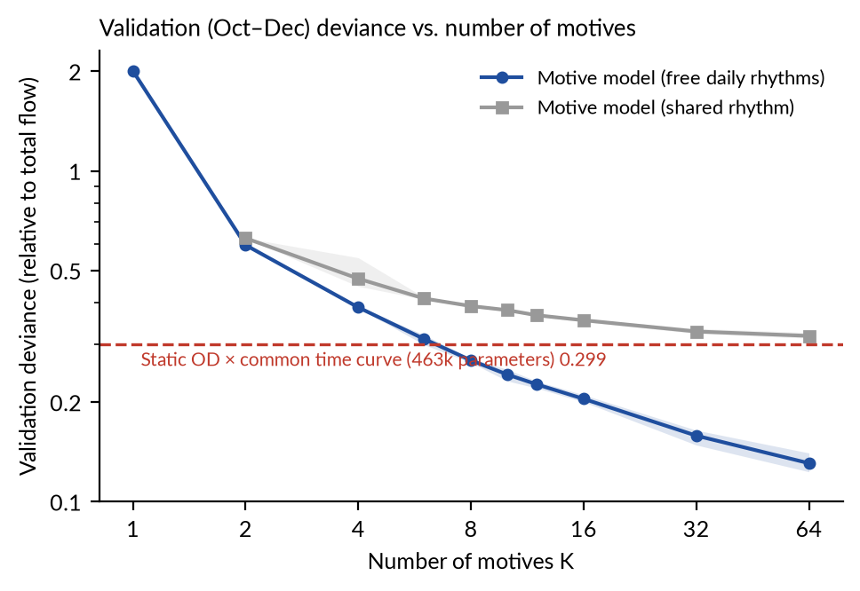
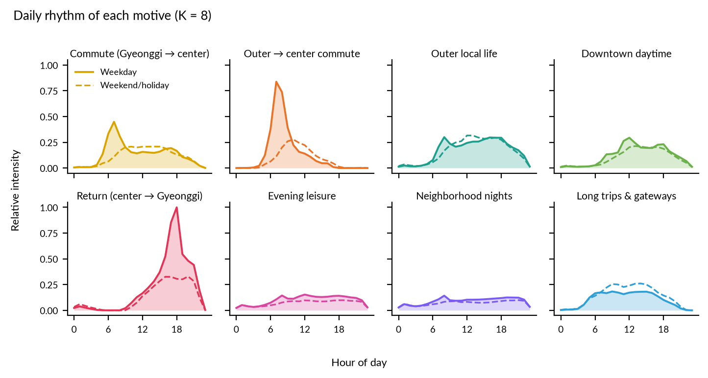
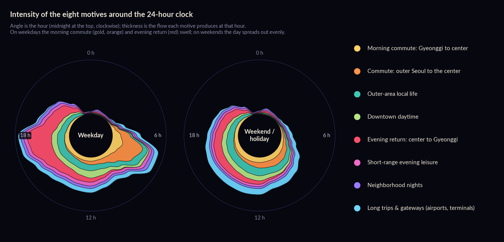
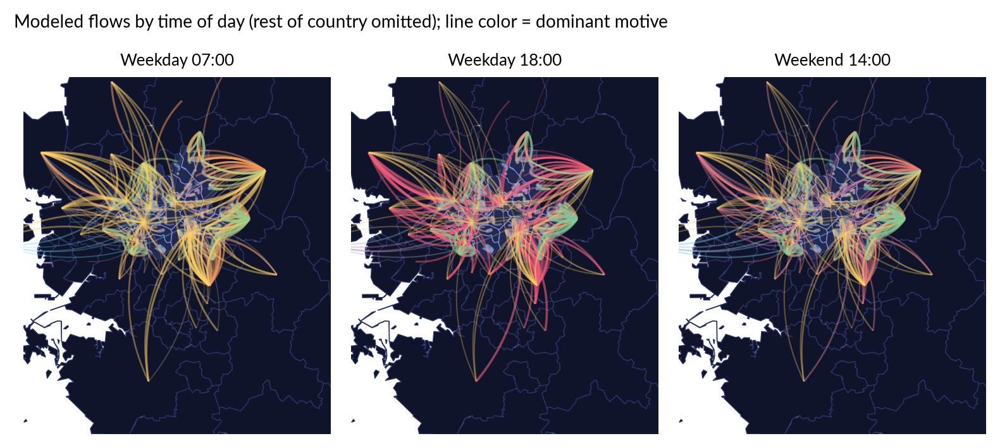
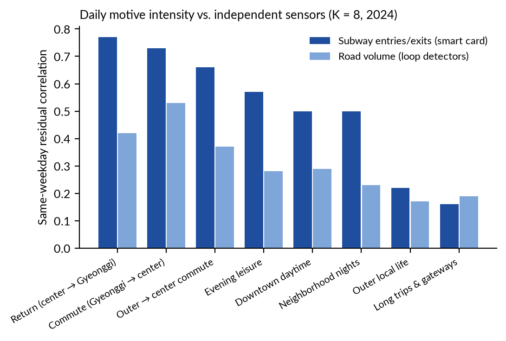
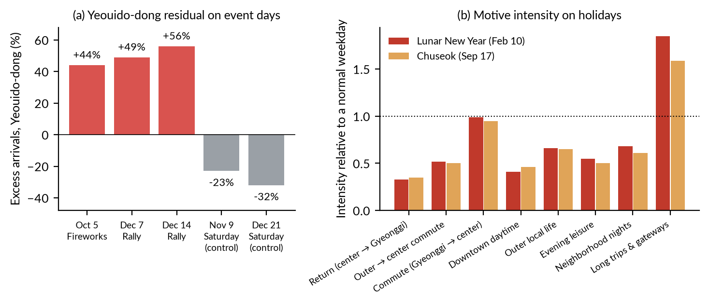
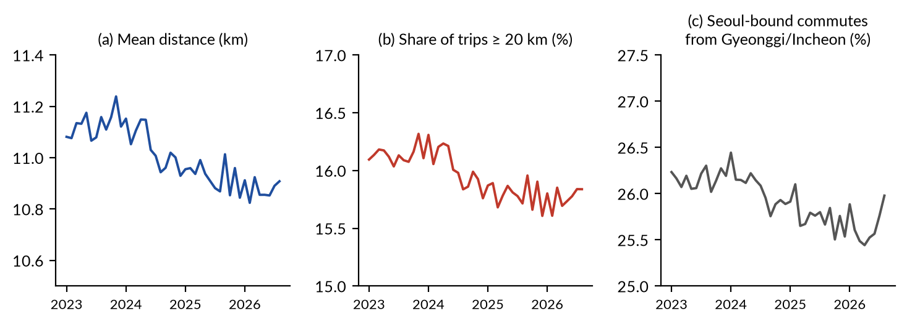
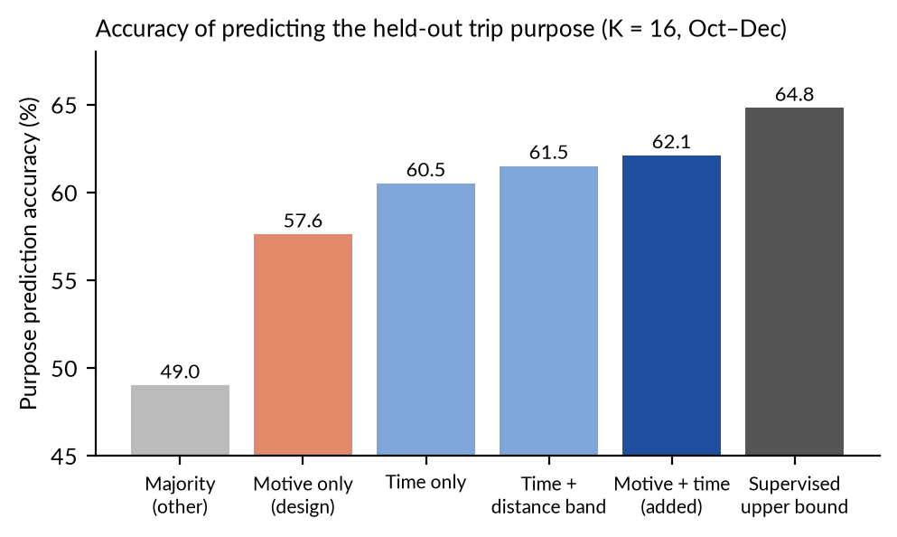

**TL;DR.** I took a year of hourly trips between 481 districts of the Seoul metropolitan area (Seoul Metropolitan Government and KT mobility data, 2024) and asked whether a few hidden travel motives could explain them. The model only ever saw flow counts. Everything else in the data, including trip purpose and nationality, was kept as an answer key.

1. **Six motives (about 6,000 parameters)** explain held-out months as well as a static OD model with **463,000 parameters**. With **eight motives the error is 12% lower**.
2. Motives need their own daily rhythms. Forcing them to share one makes the error **47% worse**.
3. The daily strength of the commuting motives moves with **subway smart-card counts** at a correlation of **0.66–0.77**. The long-distance motive sits at 0.16.
4. On the days of the **Seoul International Fireworks Festival and two rallies in Yeouido**, the model leaves **+44% to +56%** unexplained arrivals in Yeouido-dong. Ordinary Saturdays show **−23% and −32%**.
5. What did not work: recovering the held-out trip-purpose label beats a time-of-day-only guess by just **1.6 percentage points**, and no "tourist" motive appeared, because short-term foreigners move almost exactly like Korean nationals (hourly correlation **0.976**).
6. A side result: Seoul commute distances **did not grow** in 2023–2026 (mean **11.11 km → 10.88 km**).

The full write-up is a working paper: **[PDF (English)](han2026seoulmotives_en.pdf)**. The original Korean draft is also available: **[Korean version (PDF)](han2026seoulmotives_ko.pdf)**.

---

## Why ask this question?

Mobility data has become very rich. Telecom-based datasets now tell us, every day, how many people moved from one district to another and at what hour. What they do not tell us directly is *why*. Travel surveys ask about purpose, but they run every few years on small samples. The purpose field in telecom data is not an answer either: it is the provider's own rule-based guess.

So I turned the question around. Suppose that behind all these flows there are a few hidden motives, and each motive has a simple character: where its trips tend to start, where they tend to end, at what hour they happen, and how far they go. Can we find those motives from the flows alone? And if we can, do they agree with information the model has never seen?

Before training anything, I wrote down six hypotheses, each with an expected result and a reason. I report the ones that failed alongside the ones that held.

## The data

| Source | What it gives | How I used it |
|---|---|---|
| Seoul Metropolitan Mobility (Seoul Metropolitan Government & KT, OA-22300) | hourly trips between districts, with purpose, Korean/foreign status, distance | main data: 2024 for the model, 2023–2026 for checks |
| Subway smart-card counts | daily entries and exits, Seoul-wide | independent test of the motives |
| TOPIS road detectors | daily road volume and mean speed | independent test |
| Known event days | fireworks festival, rallies, holidays, heavy snow | test of what the model cannot explain |

The network has **481 nodes**: 426 Seoul districts (*dong*), 54 cities and counties in Gyeonggi and Incheon, and one node for the rest of the country. I kept every flow that starts or ends in Seoul (43.4% of all 2024 flows). The model was trained on January–September 2024 and tested on October–December. In the training months, Seoul-related flows are about 26.3 million trips on a weekday and 21.1 million on a weekend day.

## The model, in words

Each motive is a small recipe with four ingredients:

- **where from**: a distribution over origin districts
- **where to**: a distribution over destination districts
- **what time**: its own 24-hour rhythm, separately for weekdays and weekends
- **how far**: a distance scale, so that trips become rarer as the distance grows

The expected number of trips between two districts at a given hour is the sum of what each motive contributes. Three old ideas sit underneath. Flows are counts of people, so the model uses a Poisson likelihood. The distance part is a gravity model, the workhorse of transport research. And splitting the total into a sum of parts is the same idea as a topic model, where a document is a mix of topics.

The model only sees counts. Trip purpose, nationality and distance labels are never used for training. Each fit takes a few seconds on one GPU.

## Result 1: a few motives are enough

The red dashed line is a strong but blunt baseline: it memorizes the average size of every origin–destination pair (462,770 numbers) and multiplies it by one common daily curve. Six motives reach the same validation error (0.298 vs. 0.299) with 76 times fewer parameters. Eight motives are 12% better (0.263). The gray line is the same model with one shared daily rhythm, and it is much worse: 47% at eight motives.

There is no sharp "elbow" in the curve, so the error alone cannot tell me the right number of motives. I used eight as the overview and sixteen for detail. Honest caveat: the motives are not perfectly reproducible across random seeds. Large motives come back reliably, but small ones merge and split. Read the individual motives as examples; the aggregate tests below are more trustworthy.

## Result 2: what the motives look like

The eight motives, in order of size:

| Motive (my interpretation) | Share of flow | Weekday peak | Where (from actual flows) |
|---|---:|---|---|
| Evening return, center → Gyeonggi | 18.2% | 18 h | Yeoksam 1-dong, Yeouido-dong, Jongno → Namyangju, Goyang, Bundang |
| Outer-area local life | 17.0% | 8 h (weekend 13 h) | within Hanam, Goyang, Jingwan-dong |
| Morning commute, Gyeonggi → center | 12.6% | 7 h | Namyangju, Bundang, Goyang → Yeoksam 1-dong, Yeouido-dong, Jongno |
| Long trips and gateways | 12.4% | 9 h (weekend 14 h) | rest of country, Gonghang-dong ↔ Incheon Airport, Banpo 4-dong |
| Downtown daytime | 11.4% | 12 h | within Jongno, Yeouido-dong, Hangangno-dong |
| Outer Seoul → center commute | 11.2% | 7 h | Segok-dong, Jingwan-dong, Doksan 1-dong → Yeouido-dong, Yeoksam 1-dong |
| Short-range evening leisure | 8.8% | 12 h (weekend 19 h) | within Yeoksam 1-dong, Hwayang-dong, Sageun-dong |
| Neighborhood nights | 8.3% | 8 h (weekend 21 h) | within Sinchon-dong, Seogyo-dong, Heukseok-dong |

The morning commute and evening return connect the same business districts with the same Gyeonggi cities, in opposite directions and at opposite hours. The long-trips motive, built around airports and the Express Bus Terminal, is 1.32 times stronger on weekends than on weekdays. The smaller motives look like local clusters around one or two neighborhoods.

Laid out on a map, the same roads switch motive with the hour: at 07:00 gold commute lines converge on the center, and at 18:00 red return lines fan back out.

(The node positions on the maps are approximate, because I did not have district boundary polygons. They are used only for drawing.)

## Result 3: the motives move with an independent sensor

The strongest test uses data that has nothing to do with telecom records. I froze the motives and estimated only how strong each one was on each day of 2024. Then I compared those daily strengths with subway smart-card counts, after removing the usual weekday pattern from both.

The commuting motives move closely with the subway: **0.77, 0.73 and 0.66**. The long-trips motive barely does (**0.16**), which makes sense for airport and intercity travel. Road volume shows the same ordering but weaker (at most 0.53). Because the two measurements are independent, rising and falling together on the same days is good evidence that the motives reflect real behavior and not just a convenient factorization.

## Result 4: what the model cannot explain on special days

If the motives capture the ordinary city, unusual gatherings should show up in what is left over.

On the day of the Seoul International Fireworks Festival (October 5), Yeouido-dong received **237,074 more arrivals than expected (+44%)**, and riverside districts nearby also lit up (Ichon 2-dong +86%). On the two rally days in Yeouido (December 7 and 14), the excess was **+49% and +56%**. Two ordinary Saturdays, used as controls, show **−23% and −32%**. The events barely move the daily motive strengths; they appear only in the destination residuals, which is what the design predicts.

Holidays tell a mixed story. On Lunar New Year and Chuseok, the evening-return motive falls to about a third of a normal weekday and long trips rise by 1.6–1.9 times. But one commuting motive hardly falls at all (0.99 and 0.95), so my prediction that commuting would drop below 30% was wrong.

One finding I did not expect: the model picks out **de facto days off** without any calendar. Commuting collapsed on Labor Day (May 1), the day after Memorial Day (June 7), September 30 before a temporary holiday, and the last days of December.

## A side question: are commutes getting longer?

Housing prices in Seoul have risen, and a common assumption is that people now commute farther. The same data can check this for work trips on Tuesdays to Thursdays.

| January–August average | 2023 | 2024 | 2025 | 2026 |
|---|---:|---:|---:|---:|
| Mean commute distance (km) | 11.11 | 11.07 | 10.93 | 10.88 |
| Share ≥ 20 km | 16.1% | 16.1% | 15.8% | 15.8% |
| Seoul-bound commutes from Gyeonggi/Incheon | 26.2% | 26.2% | 25.8% | 25.7% |

There is no sign of an increase. Mean distance is drifting down by about 0.8% per year. This does not mean housing prices have no effect: three and a half years is short, moving house changes commutes slowly, and this data contains no prices at all.

## What did not work

**Recovering trip purpose.** I expected the motives to recover the provider's purpose labels well, around 65–70% accuracy. They did not.

Used as designed, one purpose mix per motive, the motives did worse than a guess based on time of day alone (57.6% vs. 60.5%). Letting each motive have a purpose mix per hour reaches 62.1%, which is only **1.6 percentage points** above time only and far from the supervised ceiling of 64.8%. Purpose labels are rule-based guesses by the provider, mostly determined by home and work locations and time of day, and my motives added little beyond that.

**Finding tourists.** I expected a motive with at least twice the average share of short-term foreigners, heading to Myeong-dong or Hongdae with no morning peak. None appeared. When I looked into why, the label itself turned out to be the issue: trips labeled as short-term foreigners have almost the same hourly pattern as those of Korean nationals (correlation 0.976 on weekdays, similar rush-hour shares), and they make up 16.5% of all trips, about 4.3 million a day. That is not what tourists look like. I could not confirm what the label really captures.

Two more misses: heavy snow in late November did not visibly delay commuting, and the night of the martial-law declaration on December 3 left no clear trace in the daily flows.

## Limitations

- Individual motives depend on the random seed (matched cosine 0.74–0.83). The large motives are stable; the small ones are less so.
- Purpose and nationality labels are the provider's estimates, so recovering them would not mean recovering real reasons.
- The model describes the average day. Events show up only as residuals.
- Districts outside Seoul are coarse (city or county level), and trips that never touch Seoul are excluded.
- The commute-distance trend covers only 3.6 years and cannot test a link with housing prices.

## A note on how this was made

I used an AI assistant (Claude) to write the analysis and figure code, draw the figures, produce the narrated video, and write the English versions of the paper and this post from my Korean draft. Every number was computed directly from the data by that code. I chose the questions and the hypotheses, and I am responsible for the interpretation.

If you work with telecom mobility data, or you know what the short-term-foreigner label in this dataset actually measures, I would be glad to hear from you.

**Download:** [Working paper, English (PDF)](han2026seoulmotives_en.pdf) · [Korean version (PDF)](han2026seoulmotives_ko.pdf) · [Seoul Metropolitan Mobility data (OA-22300)](https://data.seoul.go.kr/dataList/OA-22300/F/1/datasetView.do)
