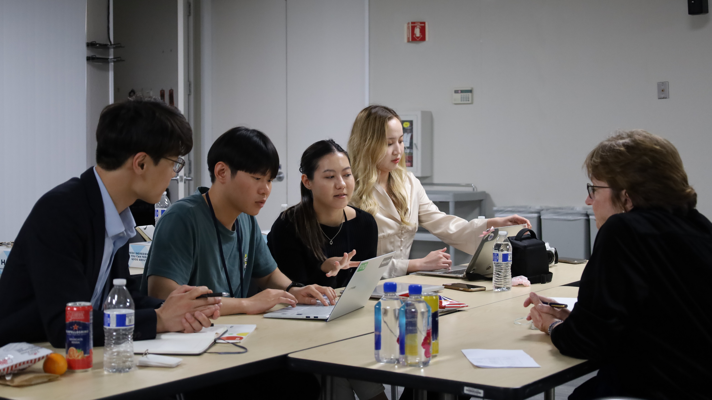
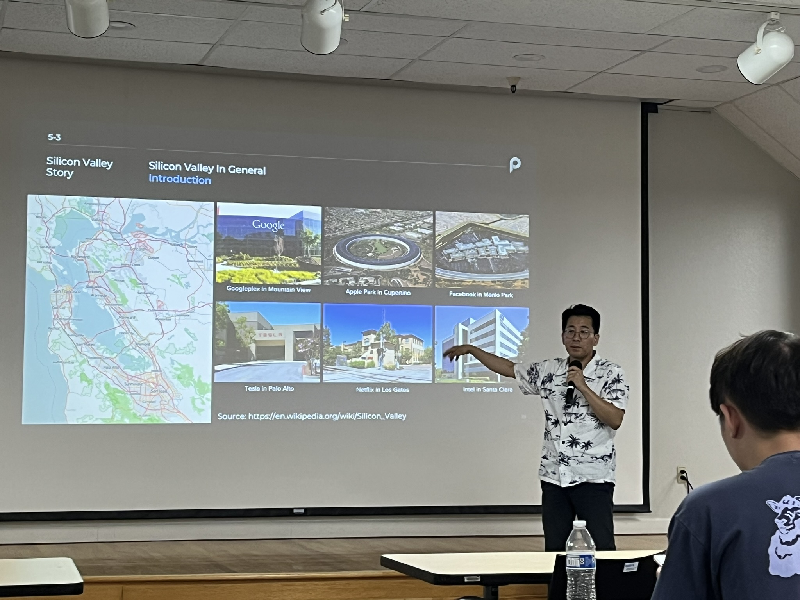
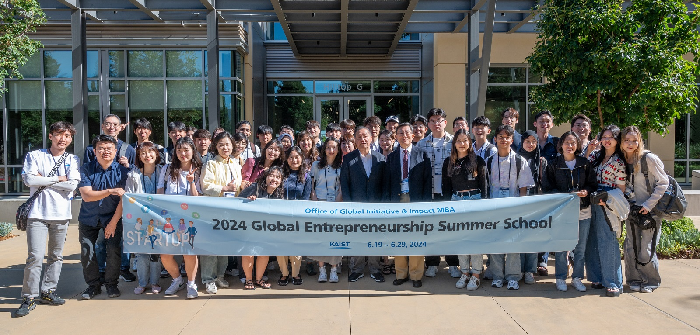

The GESS program has been an incredible opportunity for me.

I have been involved with Computer Science since high school and have always wanted to become like Mark Zuckerberg of Facebook or Bill Gates of Microsoft, who dropped out of college and built giant companies. From the moment I entered KAIST as an undergraduate, I dreamed of starting a business through entrepreneurship programs and startup internships. However, the Korean corporate culture, the relationship between investors and entrepreneurs, and the activation of the stock and M & A markets were insufficient for the emergence of unicorn companies. As a result, even while pursuing my Ph.D., I always dreamed of creating such a startup.

Even during my Ph.D., I consistently participated in hackathons and entrepreneurship-related events, nurturing my deep-seated dream of starting a business. My research also aimed at practical applications and potential collaborations with companies rather than merely producing academic papers. As my graduation approached, I learned about the GESS program, and without hesitation, I applied, feeling it was fate. I met passionate and kind team members like Jaewoong, Merey, Alina, and Sejun. Through market research, we came up with the idea of a service to solve visa issues for immigrants. Through various interviews and mentoring sessions, we received feedback on effectively delivering our business ideas and pitches, ultimately winning the competition.

In this process, our team members collaborated to propose ideas equally and provide better services for our clients through consensus. Although there were a few conflicts, they stemmed not from personal pride but from a genuine desire to lead the team in a better direction. If the team culture relies on a single person, even one with a Ph.D. or an esteemed career, to make all the decisions, it might increase accuracy but doesn't guarantee that person will always be correct. Additionally, it may put undue pressure on the person to avoid mistakes and hesitate to take risks. However, when everyone presents their ideas and makes decisions collectively, there is less fear of mistakes. The team can rely on each other and compensate for each other's shortcomings. I believe entrepreneurship involves harmoniously advancing finance, technology, and culture toward a more developed world and ideology. Therefore, as introduced by many Korean senior entrepreneurs, Silicon Valley is a rapidly improving utopia for startup enthusiasts, unlike anywhere in the world.

It will be possible to create a similar Silicon Valley in Korea. Korea is currently facing various social issues, such as low birth rates and conflict between social groups of people, due to the industry centered on large corporations and the concentration in the metropolitan area. I think these are the side effects of bureaucratic academic elitism that hinder industrial development. However, unlike Japan or China, Korea is more open to accepting immigrants and cultures from overseas, similar to the United States. Just as Silicon Valley operates and contributes to the development of the U.S., thanks to excellent immigrants, I see the potential for a similar economic model in Korea. The GESS program at KAIST might be showcasing the future of Korean corporate culture. In this century, a future where excellent talents worldwide can work happily in Korea will come to fruition.  

[KAIST NEWS](https://news.kaist.ac.kr/newsen/html/news/?mode=V&mng_no=37970)

– Sumin Han
