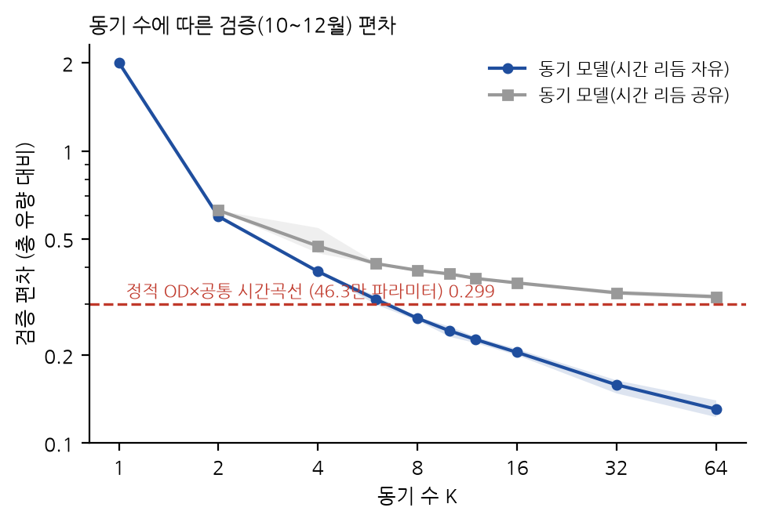
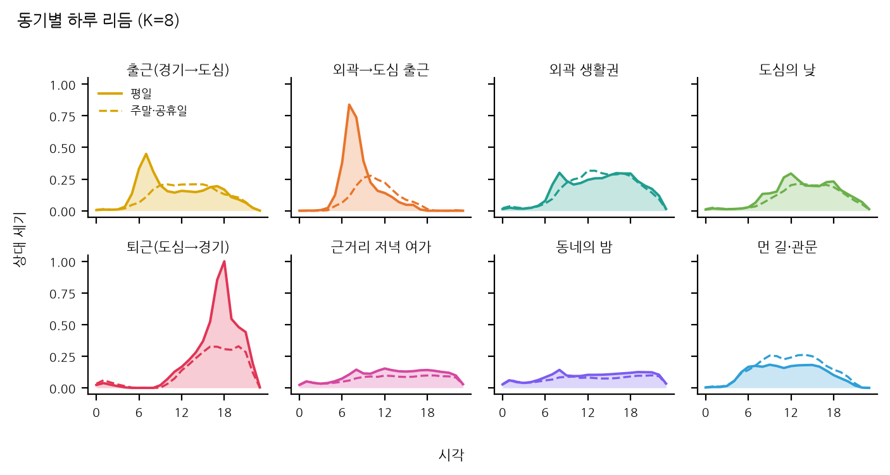
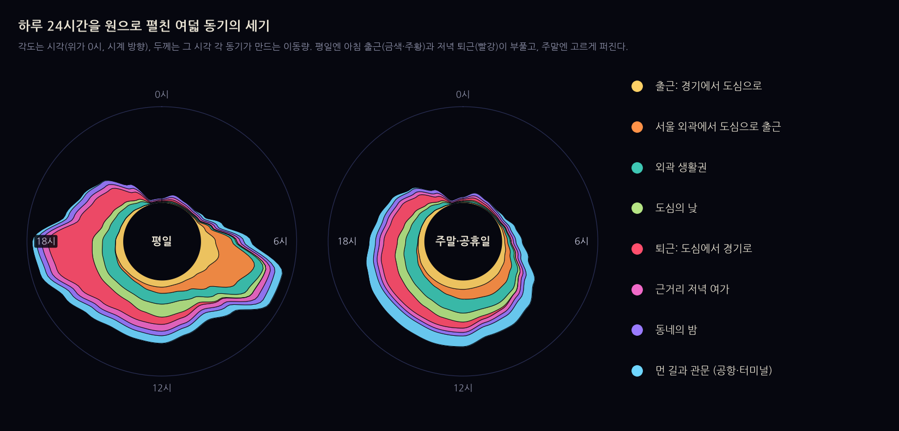
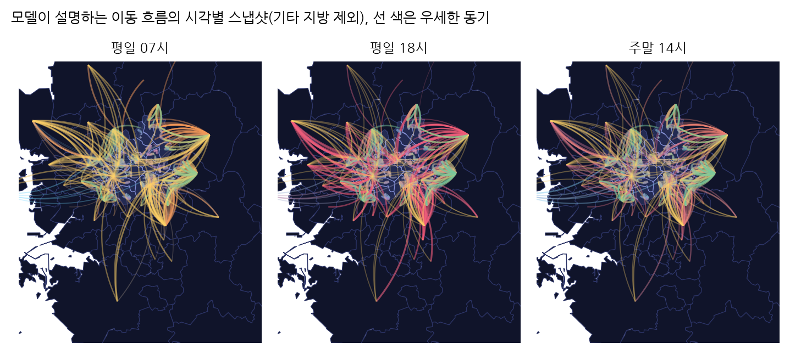
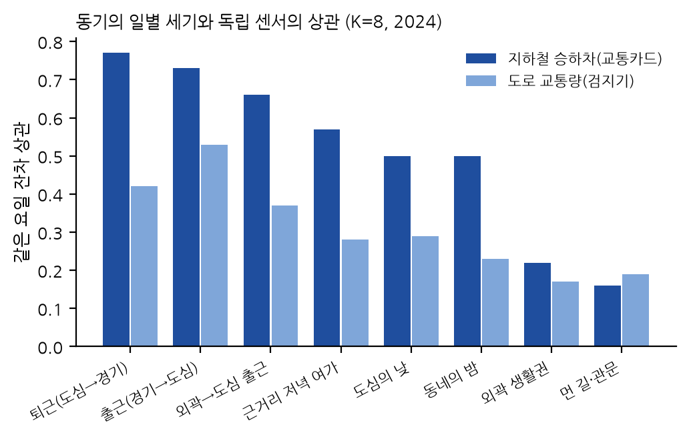
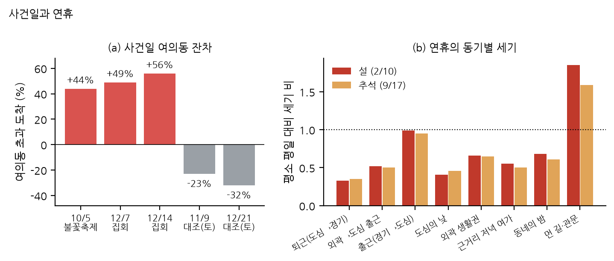
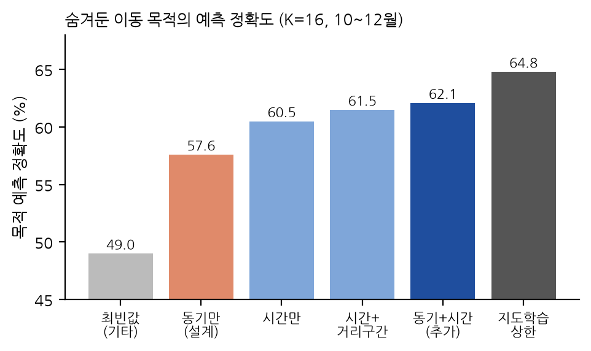
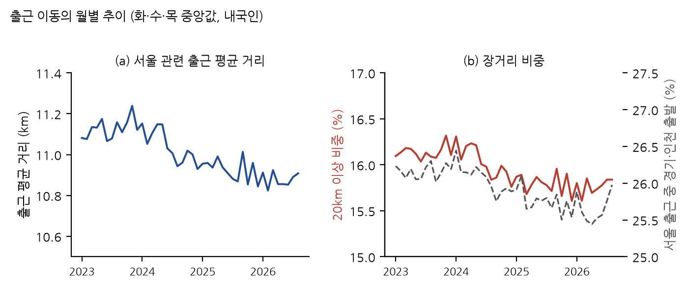

> **한 줄 요약.** 서울 수도권의 시간대별 이동 흐름은 여덟 가지 정도의 "숨은 동기"로 잘 설명된다. 그 동기는 교통카드와 같은 날 같이 움직이고, 불꽃축제와 집회가 있던 날에는 정확히 여의도에서 모델 밖의 흐름이 튀어나온다. 다만 데이터에 붙어 있는 이동 목적 라벨을 되살리는 힘은 생각보다 약했다.

## 영상으로 보기



5분 23초짜리 설명 영상이에요. 한국어 나레이션과 자막이 들어 있어요.

## 왜 이 질문인가

요즘 도시 데이터는 사람이 **어디서 어디로, 언제** 움직였는지는 놀랄 만큼 촘촘히 보여준다. 서울시와 KT가 공개하는 "수도권 생활이동"은 행정동 사이의 이동량을 하루 단위·시간 단위로 매일 내놓는다. 하지만 사람들이 **왜** 움직였는지는 보이지 않는다. 데이터에 "출근, 귀가, 쇼핑…" 같은 목적 컬럼이 있긴 하지만, 그것도 통신 기록으로 집과 직장을 추정한 뒤 규칙으로 붙인 값이다.

그래서 반대로 물어봤다. **목적 라벨 없이, 흐름의 모양만 보고 이동을 만들어내는 숨은 동기를 찾을 수 있을까?** 그리고 그렇게 찾은 동기가 모델이 한 번도 보지 못한 정보와 맞아떨어질까?

## 데이터

- **수도권 생활이동 (출발–도착 행정동 기준)**, 2023-01 ~ 2026-08, 일별 1,339개 파일. 기간별로 쓰임이 다르다(아래 "어떻게 검증했나").
- 노드 481개: 서울 행정동 426개 + 경기·인천 시군구 54개 + 나머지 지방 1개. 서울 밖끼리의 이동(전체의 56.6%)은 뺐다.
- 하루 평균 서울 관련 이동량은 평일 약 2,630만 건, 주말 약 2,110만 건.

## 모델: 동기 하나 = "어디서, 어디로, 언제, 얼마나 멀리"

각 동기 $k$는 출발지 분포 $A_k$, 도착지 분포 $B_k$, 평일·주말별 하루 리듬 $T_{k,c}$, 세기 $s_{k,c}$, 거리 척도 $L_k$를 갖는다. 시간대 $h$에 동 $o$에서 동 $d$로 가는 기대 이동량은

$$
\mu_{c,h,o,d} = \sum_{k=1}^{K} s_{k,c}\,T_{k,c,h}\,A_{k,o}\,B_{k,d}\,e^{-\mathrm{dist}_{od}/L_k}
$$

이고, 관측 이동량에 대한 푸아송 우도로 학습한다. 요소 하나하나가 "어디 사는 사람이 어디로, 몇 시에, 얼마나 멀리 가려 하는가"라는 뜻을 갖기 때문에 결과를 읽을 수 있다.

**핵심 규칙: 목적·국적·거리 라벨은 학습에 절대 쓰지 않고 평가에만 쓴다.** 또 평가 항목과 예상치는 학습 전에 미리 적어두고, 결과를 예상과 비교해 맞은 것과 틀린 것을 둘 다 보고했다.

## 수학적 배경

수식이 낯설다면 이 절은 건너뛰어도 된다. 모델은 세 가지 오래된 아이디어를 합친 것이다.

### 1. 이동량은 '세는' 데이터: 푸아송 분포

$y_{c,h,o,d}$를 요일 유형 $c$(평일 / 주말·공휴일), 시각 $h$에 행정동 $o$에서 $d$로 간 하루 평균 이동량이라고 하자. 사람 수를 세는 데이터는 흔히 푸아송 분포로 모형화한다.

$$
P(y \mid \mu) = \frac{\mu^{y} e^{-\mu}}{y!}
$$

기대 이동량 $\mu$가 주어졌을 때 관측 $y$가 나올 확률이다. 모든 셀에 대해 음의 로그우도를 더하면 상수를 빼고

$$
\mathcal{L} = \sum_{c,h,o,d} \left( \mu_{c,h,o,d} - y_{c,h,o,d} \log \mu_{c,h,o,d} \right)
$$

가 되고, 이것을 최소화한다. 이는 $y$와 $\mu$ 사이의 일반화 KL 발산 $\sum \left[ y \log (y/\mu) - y + \mu \right]$을 최소화하는 것과 같다. 비음수 행렬 분해(Lee & Seung)에서 쓰는 바로 그 목적함수다. $y$가 여러 날의 평균이라 정수가 아니지만 같은 식을 준우도(quasi-likelihood)로 쓸 수 있다.

### 2. 가까울수록 많이: 중력 모형

교통 연구의 고전인 중력 모형은 두 지역 사이의 이동량을 출발지의 크기, 도착지의 크기, 거리 감쇠의 곱으로 본다(Zipf 1946; Wilson 1971).

$$
T_{od} \;\propto\; O_o \, D_d \, e^{-\beta\, \mathrm{dist}_{od}}
$$

Wilson의 엔트로피 최대화 모형에서 나오는 지수 감쇠형이다. 이 연구의 각 동기는 작은 중력 모형 하나다. 출발지 분포 $A_{k,o}$가 $O_o$, 도착지 분포 $B_{k,d}$가 $D_d$, 거리 척도 $L_k$가 $1/\beta$ 역할을 한다. 동기마다 $L_k$가 달라서 통근처럼 멀리 가는 동기와 동네 안에서 도는 동기가 구분된다.

### 3. 여러 동기의 합: 비음수 분해와 토픽 모형

전체 흐름은 $K$개 동기의 합이다.

$$
\mu_{c,h,o,d} = \sum_{k=1}^{K} \underbrace{s_{k,c}\, T_{k,c,h}\, A_{k,o}\, B_{k,d}\, e^{-\mathrm{dist}_{od}/L_k}}_{\mu^{(k)}_{c,h,o,d}}
$$

시간 리듬 $T$, 출발지 $A$, 도착지 $B$의 외적에 거리 감쇠를 곱한 비음수 텐서 분해(CP 분해와 비슷한 형태)다. 문서의 단어를 여러 주제의 혼합으로 보는 토픽 모형(LDA)처럼, 각 이동을 여러 동기 중 하나에서 나온 것으로 볼 수 있다. 어떤 셀의 이동이 동기 $k$에서 나왔을 사후 확률은

$$
r_k = \frac{\mu^{(k)}}{\sum_j \mu^{(j)}}
$$

이고, 숨겨둔 라벨과 비교할 때 이 값을 쓴다.

### 4. 매개변수화와 학습

모든 분포를 소프트맥스로 두어 합이 1인 확률분포가 되게 했다.

$$
A_{k,o} = \frac{e^{a_{k,o}}}{\sum_{o'} e^{a_{k,o'}}}, \qquad T_{k,c,h} = \frac{e^{\tau_{k,c,h}}}{\sum_{h'} e^{\tau_{k,c,h'}}}, \qquad s_{k,c} = e^{\sigma_{k,c}}, \qquad L_k = \mathrm{softplus}(\ell_k) + 0.1
$$

($B$도 $A$와 같은 꼴이다.) 동기 하나의 매개변수는 출발지 481개, 도착지 481개, 하루 리듬 48개(24시간 × 평일·주말), 세기 2개, 거리 척도 1개를 합친 1,013개다. 동기 8개면 8,104개로, OD 쌍마다 값을 하나씩 외우는 정적 모형(462,770개)의 57분의 1이다. 학습은 전체 배치 Adam(학습률 0.05에서 0.002까지 코사인 감쇠)으로 4,000 스텝을 돌렸고, 초기값을 바꾼 5번 중 학습 오차가 가장 작은 것을 썼다. 거리 $\mathrm{dist}_{od}$는 데이터에 기록된 평균 이동거리(이동 인구 가중 평균)를 쓰고, 한 해 동안 한 번도 관측되지 않은 쌍은 관측된 거리로 만든 그래프의 최단 경로로 채웠다.

### 5. 평가 지표: 푸아송 편차

모형 비교에는 총 유량으로 나눈 푸아송 편차를 썼다. 0에 가까울수록 잘 맞는다.

$$
D = \frac{2}{\sum y} \sum_{c,h,o,d} \left[ y \log \frac{y}{\mu} - (y - \mu) \right]
$$

비교 기준인 정적 모형은 $\mu_{c,h,o,d} = \mathrm{OD}_c[o,d] \cdot P(h \mid c)$, 곧 OD 쌍별 하루 총량에 모든 쌍이 공유하는 하루 시간 곡선을 곱한 것이다. 이 모형은 아침에 A→B, 저녁에 B→A로 방향이 뒤집히는 구조를 표현하지 못한다.

### 6. 날짜별 동기 세기: EM 갱신

교통카드·사건일 분석에서는 동기의 모양($A, B, T, L$)을 고정하고 날짜 $t$마다 세기 $\lambda_k(t)$만 다시 추정했다. $G_k[o,d] = A_{k,o} B_{k,d} e^{-\mathrm{dist}_{od}/L_k}$라고 두면 푸아송 우도의 EM(비음수 분해의 곱셈 갱신과 같다)은 다음과 같다.

$$
\lambda_k \leftarrow \lambda_k \cdot \frac{\sum_{h,o,d} \left( y_{t,h,o,d} / \mu_{t,h,o,d} \right) T_{k,c(t),h}\, G_k[o,d]}{\sum_{h,o,d} T_{k,c(t),h}\, G_k[o,d]}
$$

60번 반복했다.

### 7. 독립 센서와의 비교: 같은 요일 잔차 상관

요일 효과를 지우려고 각 날짜의 값에서 '비슷한 날'의 평균을 뺐다.

$$
\tilde{x}(t) = x(t) - \frac{1}{|W(t)|} \sum_{t' \in W(t)} x(t')
$$

$W(t)$는 $t$ 앞뒤 28일 안에서 요일과 공휴일 여부가 같은 날들(자기 자신 제외)이다. 동기 세기의 잔차 $\tilde{\lambda}_k$와 지하철 승하차 잔차의 피어슨 상관을 구했다.

### 8. 사건일 잔차

사건일 $t$의 '평소라면'의 흐름은 같은 요일 평범한 날들의 평균 세기 $\bar{\lambda}_k$로 계산한다. 도착 행정동 $d$의 초과량은

$$
\Delta_d(t) = \sum_{h,o} \left( y_{t,h,o,d} - \hat{\mu}_{t,h,o,d} \right), \qquad \hat{\mu}_{t,h,o,d} = \sum_k \bar{\lambda}_k\, T_{k,c(t),h}\, G_k[o,d]
$$

이고, 본문의 퍼센트는 $\Delta_d / \sum_{h,o} y_{t,h,o,d}$이다.

### 9. 숨겨둔 목적 라벨 맞히기

학습 기간에서 동기와 목적 $p$의 결합량 $J_{k,p} = \sum r_k\, y^{(p)}$를 세어 $P(p \mid k)$(또는 시간대별 $P(p \mid k, c, h)$)를 구하고, 검증 기간의 각 셀에서 목적 비율을 $\hat{q}_p = \sum_k r_k\, P(p \mid k)$로 예측했다. 점수는 흐름으로 가중한 교차엔트로피 $-\sum y^{(p)} \log \hat{q}_p / \sum y$와 정확도다.

## 어떻게 검증했나

데이터는 2023-01부터 2026-08까지 있지만, 기간마다 역할이 다르다.

| 기간 | 역할 |
|---|---|
| **2024년 1~9월** | 동기 학습 (여기서만 동기를 찾는다) |
| **2024년 10~12월** | 주 검증: 학습에 안 쓴 석 달을 설명하는가. 아래 결과 1~3의 숫자는 모두 여기서 나왔다 |
| **2025년 전체** | 다음 해 검증: 2024년 동기를 고치지 않고 그대로 가져가 본다 |
| 2023년 전체 | 참고: 따로 학습해도 비슷한 동기가 나오는지만 비교 |
| 2023-01 ~ 2026-08 | 덤으로 본 출근 거리 추이 |

- **다음 해에도 통했다.** 2024년 동기를 그대로 2025년 하루 평균 흐름에 적용하면 오차(푸아송 편차)가 0.241로, 2025년 데이터에 직접 맞춘 46만 파라미터짜리 단순한 모델(0.258)보다 낮았다. 단, 2025년 데이터로 동기 모델을 새로 학습하면 0.230으로 더 좋아서, 해마다 조금씩 달라지는 부분은 있다.
- **2023년에 따로 학습한 동기**는 2024년 동기 8개 중 5개와 거의 같았다(코사인 0.97~1.00).
- **2026년은 동기 분석에서 뺐다.** 화성시가 4개 구로 나뉘고(2026년 초), 인천 중구·동구·서구가 제물포·영종·서해·검단구로 재편되면서(2026년 7월) 지역 단위가 바뀌었기 때문이다.
- 교통카드 비교와 사건일 분석은 2024년 한 해의 날짜들로 했다.
- 약점도 있다. 주 검증이 석 달뿐이고, 학습(1~9월)과 검증(가을·겨울)의 계절이 다르다.

## 결과 1. 동기 6~8개면 충분하다

- 동기 **6개**(파라미터 약 6천 개)로 OD 쌍마다 규모를 외우는 **46만 파라미터** 정적 모델과 같은 검증 오차에 도달했다. 8개에서는 12% 더 낮다.
- 모든 동기가 하나의 하루 리듬을 공유하게 하면 오차가 47% 나빠진다. **동기마다 하루 리듬이 다르다**는 것이 이 모델의 핵심이다.

## 결과 2. 여덟 가지 동기

| 동기 (해석) | 흐름 비중 | 평일 정점 | 대표적인 출발 → 도착 |
|---|---:|---:|---|
| 퇴근 (도심 → 경기) | 18.2% | 18시 | 역삼·여의도·종로 → 남양주·고양·분당 |
| 외곽 생활권 | 17.0% | 8시 (주말 13시) | 하남·고양·은평 진관동 일대 |
| 출근 (경기 → 도심) | 12.6% | 7시 | 남양주·분당·고양 → 역삼·여의도·종로 |
| 먼 길과 관문 | 12.4% | 9시 | 지방·김포공항·고속터미널 ↔ 인천공항 |
| 도심의 낮 | 11.4% | 12시 | 종로·여의도·용산 안 |
| 서울 외곽 → 도심 출근 | 11.2% | 7시 | 세곡·진관·독산 → 여의도·역삼 |
| 근거리 저녁 여가 | 8.8% | 주말 19시 | 역삼·건대·사근 일대 |
| 동네의 밤 | 8.3% | 주말 21시 | 신촌·홍대(서교)·흑석 일대 |

동기 이름은 모델이 붙인 게 아니라 결과를 보고 사람이 붙인 해석이다.

퇴근과 출근은 같은 지역들을 반대 방향, 반대 시각으로 잇는 **거울상**이다. "먼 길과 관문"은 인천공항·김포공항·고속터미널을 중심으로 하는 장거리 이동인데, 평일보다 주말에 1.3배 크고 외국인 비중도 가장 높다.

## 결과 3. 모델이 보지 못한 것으로 시험하기

### 교통카드와 같은 날 같이 움직인다 ✅

통신 기록으로 만든 동기의 날짜별 세기를, 완전히 다른 측정인 **교통카드 지하철 승하차**와 비교했다(요일 효과는 빼고).

통근 동기는 지하철과 **0.66~0.77**의 상관을 보이고, 공항·터미널 동기는 0.16으로 거의 무관하다. 측정 방식이 다른 두 데이터가 같은 날 같이 흔들린다는 건, 동기가 측정 잡음이 아니라 실제 행동이라는 증거다.

### 여의도가 놀란 날 ✅

평소 동기 세기로 "그날 있을 법한 흐름"을 계산하고 실제와의 차이를 동네별로 봤다.

- **서울세계불꽃축제(2024-10-05)**: 여의동 +23.7만 건(+44%), 그리고 노량진·이촌동 같은 한강변 관람 지점.
- **여의도 집회(2024-12-07, 12-14)**: 여의동 +28만 건(+49%), +37만 건(+56%).
- 같은 계산을 **평범한 토요일**에 하면 여의동은 오히려 −23%, −32%.

사건은 동기의 세기에는 거의 드러나지 않고 "모델이 설명하지 못한 나머지"로 정확히 그 장소에 나타났다.

### 사실상 쉬는 날을 찾아낸다 (예상 밖)

달력 정보 없이도 통근 동기가 무너진 날이 보인다. **5월 1일 근로자의 날**, 현충일 다음 날(6/7), 임시공휴일 전날(9/30), 연말(12/29~31). 공식 휴일은 아니지만 많은 사람이 쉬는 날이다.

### 목적 라벨은 잘 되살리지 못했다 ❌

숨겨둔 목적 라벨을 동기로 예측하면, 시간대만 쓴 예측(60.5%)을 겨우 넘는 62.1%에 그쳤다(라벨로 직접 학습한 상한은 64.8%). 처음 예상(65~70%)보다 한참 낮다. 쇼핑·관광·병원은 전체 흐름의 1% 미만이라 따로 잡히지 않았다.

### "단기외국인"은 관광객처럼 움직이지 않는다 (예상 밖)

외국인 관광 동기가 따로 나올 거라 예상했지만 나오지 않았다. 원인을 보니 **단기외국인의 시간대별 이동 패턴이 내국인과 거의 같았다**(상관 0.976). 출퇴근 피크도 있고, 하루 430만 건으로 전체의 16.5%나 된다. 관광객이라고 보기엔 너무 많고 너무 일상적이다. 모델이 실패했다기보다 이 라벨이 무엇을 뜻하는지부터 확인이 필요하다.

## 덤: 출퇴근 거리는 늘었을까?

집값이 오르면서 출퇴근이 더 멀어졌는지 같은 데이터로 확인했다(출근 목적, 내국인, 화·수·목, 2023-01 ~ 2026-08).

| | 2023 | 2024 | 2025 | 2026 |
|---|---:|---:|---:|---:|
| 출근 평균 거리 | 11.11 km | 11.07 km | 10.93 km | 10.88 km |
| 20 km 이상 비중 | 16.1% | 16.1% | 15.8% | 15.8% |
| 서울 출근 중 경기·인천 출발 | 26.2% | 26.2% | 25.8% | 25.7% |

**늘지 않았다.** 오히려 아주 조금 줄었다. 다만 3.6년은 짧고, 이 데이터에는 집값이 없어서 집값과의 관계를 말할 수는 없다.

## 한계

- 개별 동기는 초기값(시드)에 따라 합쳐지거나 쪼개진다(시드 간 일치 0.74~0.83). 큰 동기는 안정적이지만 작은 동기의 해석은 예시로 읽어야 한다.
- 목적·국적 라벨은 통신사가 추정한 값이다. 라벨을 되살려도 "실제 이유"를 되살린 것은 아니다.
- 학습은 완전히 수렴하기 전 단계에서 멈췄다. 더 오래 학습하면 오차가 3~6% 더 줄어든다.
- 행정동 경계가 없어서 지도 위 위치는 근사다.

## 데이터 출처

- 서울특별시·KT, **수도권 생활이동 (출발-도착지 기준)**, 서울 열린데이터광장 [OA-22300](https://data.seoul.go.kr/dataList/OA-22300/F/1/datasetView.do). 2023-01-01 ~ 2026-08-31, 일별.
- 서울 생활이동 데이터 안내(이동 목적 판정 방식): [data.seoul.go.kr 서울 생활이동](https://data.seoul.go.kr/dataVisual/seoul/seoulLivingMigration.do)
- 수도권 생활이동 데이터 항목 정의서(목적·수단 레이아웃), 같은 데이터셋 페이지의 첨부 문서.
- 행정동 코드 정보(월별 코드표, 2023-01 ~ 2026-08).
- 지하철 역별 시간대별 승하차 인원(교통카드), 서울 열린데이터광장 [OA-12914](https://data.seoul.go.kr/dataList/OA-12914/S/1/datasetView.do) (2023~2025년 수집 당시 시간대별 형식. 현재 시간대별 자료는 [OA-12252](https://data.seoul.go.kr/dataList/OA-12252/S/1/datasetView.do)).
- 도로 교통량·속도, 서울시 교통정보시스템(TOPIS) [자료실](https://topis.seoul.go.kr/refRoom/openRefRoom_4.do).
- 행정구역 경계(시군구·법정동, 2023년 7월 기준): 지도 그림의 위치 근사에만 사용.

## 참고문헌

- M. C. González, C. A. Hidalgo, A.-L. Barabási. Understanding individual human mobility patterns. *Nature* 453, 779–782, 2008.
- F. Calabrese, G. Di Lorenzo, L. Liu, C. Ratti. Estimating origin–destination flows using mobile phone location data. *IEEE Pervasive Computing* 10(4), 36–44, 2011.
- G. K. Zipf. The P1P2/D hypothesis: on the intercity movement of persons. *American Sociological Review* 11(6), 677–686, 1946.
- D. M. Blei, A. Y. Ng, M. I. Jordan. Latent Dirichlet allocation. *Journal of Machine Learning Research* 3, 993–1022, 2003.
- L. Alexander, S. Jiang, M. Murga, M. C. González. Origin–destination trips by purpose and time of day inferred from mobile phone data. *Transportation Research Part C* 58, 240–250, 2015.
- S. Jiang et al. The TimeGeo modeling framework for urban mobility without travel surveys. *PNAS* 113(37), E5370–E5378, 2016.
- D. D. Lee, H. S. Seung. Learning the parts of objects by non-negative matrix factorization. *Nature* 401, 788–791, 1999.
- A. G. Wilson. A family of spatial interaction models, and associated developments. *Environment and Planning* 3(1), 1–32, 1971.

## English summary

We decompose hourly origin–destination flows of the Seoul metropolitan area (Seoul–KT "Living Migration" data; motives learned on Jan–Sep 2024, tested on Oct–Dec 2024 and, unchanged, on 2025; 481 nodes) into a small number of latent travel motives. Each motive has an origin distribution, a destination distribution, a weekday/weekend daily rhythm and a distance-decay scale, fitted with a Poisson likelihood on flow counts only. Trip-purpose, nationality and distance labels are held out for evaluation. Six motives (~6k parameters) match a 463k-parameter static OD model on held-out months, and eight motives are 12% better. Daily intensities of the commuting motives track independent smart-card subway ridership (residual correlation 0.66–0.77), and on the Seoul fireworks festival and the December 2024 Yeouido rallies the unexplained excess arrivals concentrate in Yeouido (+44% to +56%, versus −23% and −32% on ordinary Saturdays). Recovering the provider's trip-purpose labels, however, beats a time-of-day baseline only marginally, and "short-term foreigner" flows turn out to follow the same daily rhythm as residents. As a side result, commuting distances to and from Seoul did not increase between 2023 and 2026.
